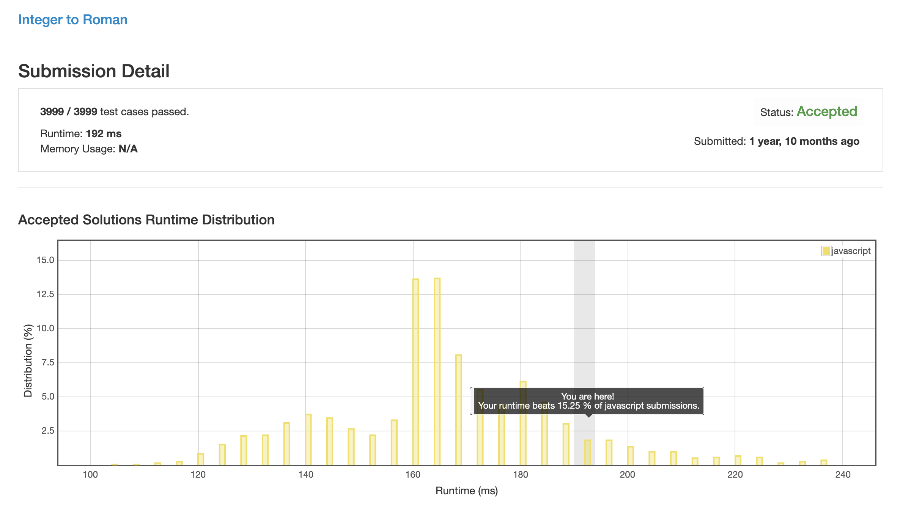
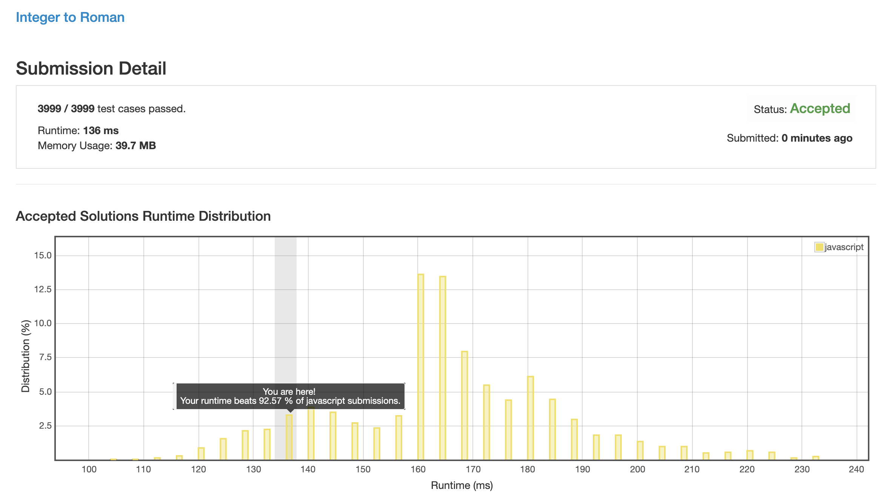

# 12. 阿拉伯数字转罗马数字

## 解法 1 (subtractor.js)

直接列出所有可能的罗马字符列表, 将目标数字从大到小逐个减去列表对应的数字, 最后当剩余数字为 0 时, 形成的字符串便是对应的罗马字数字了.

## 解法 2 (remainder.js)

求出数字的组成: m * 1000 + n * 100 + j * 10 + k * 1, 将每一位分别转换为对应的罗马字符, 拼接形成最终的字符串. 

