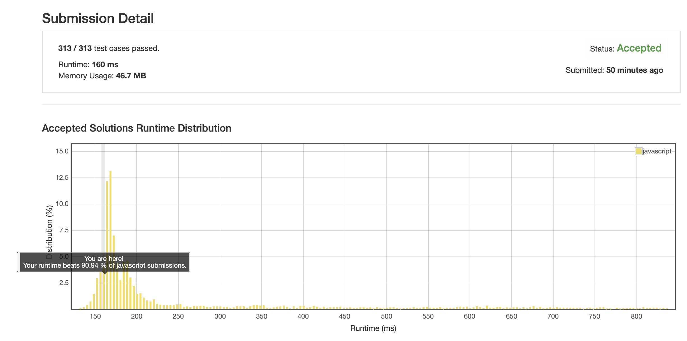

# 15. 3 数字之和

## 解法1 ([end-to-end.js](./end-to-end.js))

核心思路:

遍历整个数组, 取每个位置的数字, 并计算从它以后有哪些值对的和等于负的当前位置的值.

### 优化点

排序整个数组, 这样就可以跳过重复的数字, 不需要再搞个 map 来筛掉重复的 case 了.

另外当游标对应的值为 0 时, 后面的数字就全都是大于 0 的了, 不可能出现三值和为 0 的情况了, 也就可以直接结束了.



### 关键点

1. js 的排序函数默认用字符串类型进行比较, 顺序会有错, 所以要自定义一下.

    ```
    nums.sort((a, b) => a - b);
    ```

1. 因为整体是个有序数组, 所以当游标到达 0 以后, 它后面的数字都会是大于 0 的, 三数之和必然大于 0, 也就不用再计算了.

    ```
    if (0 < nums[i]) {
        break;
    }
    ```
    
1. 跳过重复元素的语句
