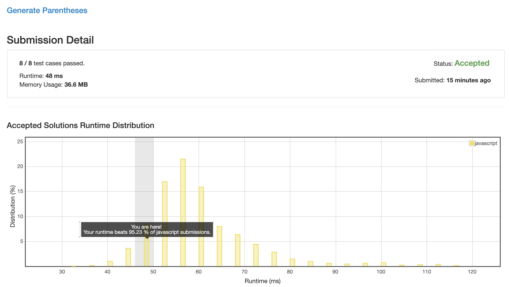

# 0022. 括号生成

一开始我给这道题理解反了, 以为让我校验整个括号字符串数组里有几对能匹配上, 我心说这题应该是 Easy 的吧, 结果代码提交上去就被教育了.

## 解法 1 ([recursion.js](./recursion.js))

思路很简单, 利用递归, 每个递归体内部, 判断还可以加几个左几个右:
 
+ 如果 `左 < 右`, 则此时又可以往后面加左也可以加右;

+ 如果 `左 === 右`, 那这时候只能加左, 加右就爆炸了;

+ 不存在 `左 > 右` 的情况, 存在就是你写错了;

+ 如果 `左 === 右 === 0` 此时的字符串就是答案中的一个值.

### 优化思路

模板字符串 `${aa}bb\` 真的比 `aa + 'bb'` 的效率高很多.

非常神奇的一个问题是, 我把 result 放在全局上, 然后递归到终点之后直接往上面 push 结果的写法.

竟然比每个递归返回一个数组, 调用者将数组拼合后返回给上级这种写法.

要慢 30% 左右, js 到底是怎么优化的啊... 作用域链寻值效率这么低么?

