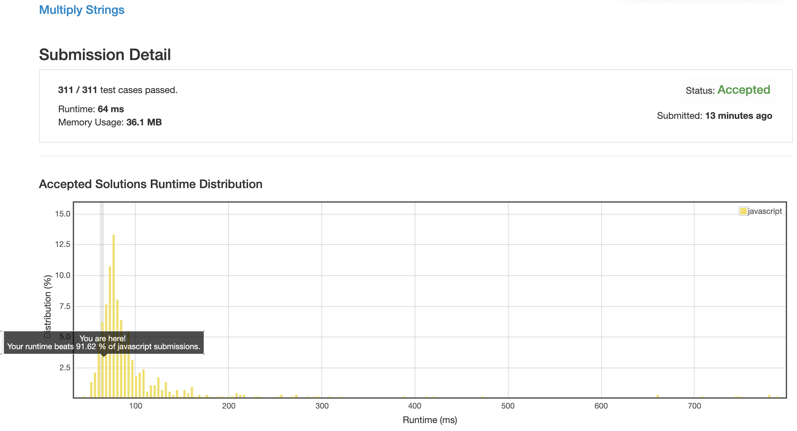

# 0043. 字符串相乘

## 解法 1 (chinese-style.js)

我现在每次看到这种实现基本操作的题目, 第一反应都是用位操作做, 这次做完之后发现被血坑, 需要手动再把二进制转成数字 (js parseInt toString 转大数字会有精度损失).

所以没有办法, 用了最原始的方法.

### 优化点

一开始成绩是 76ms, 并不是特别理想.
 
后来反思了一下, 在过程中短路 0 `|| 0`, 然后最后算完再在数组当中补 0 的行为性能消耗有点多, 甚至不如直接进行一次初始化填 0 了.

于是便这么做了, 64ms 91%, 成了. 

