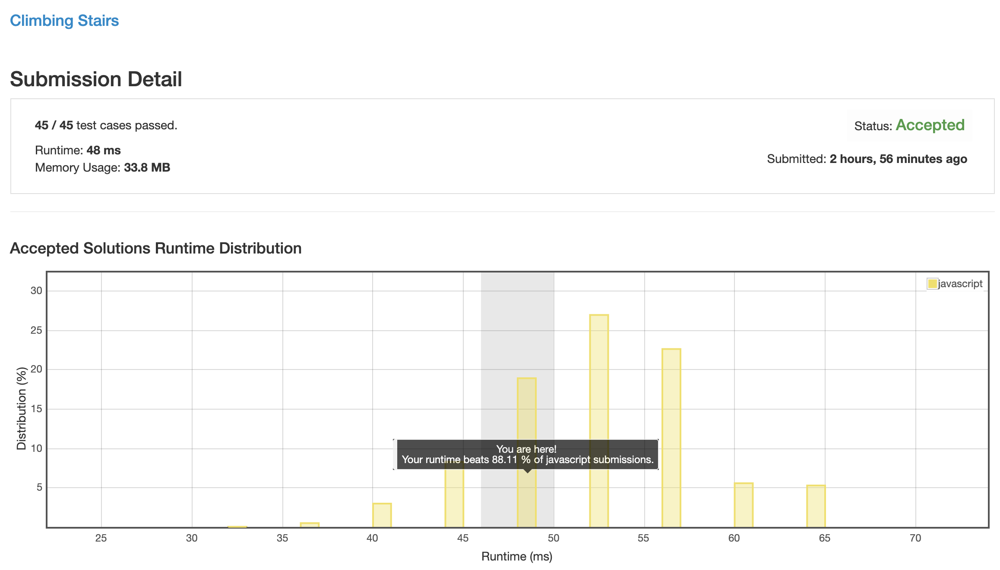
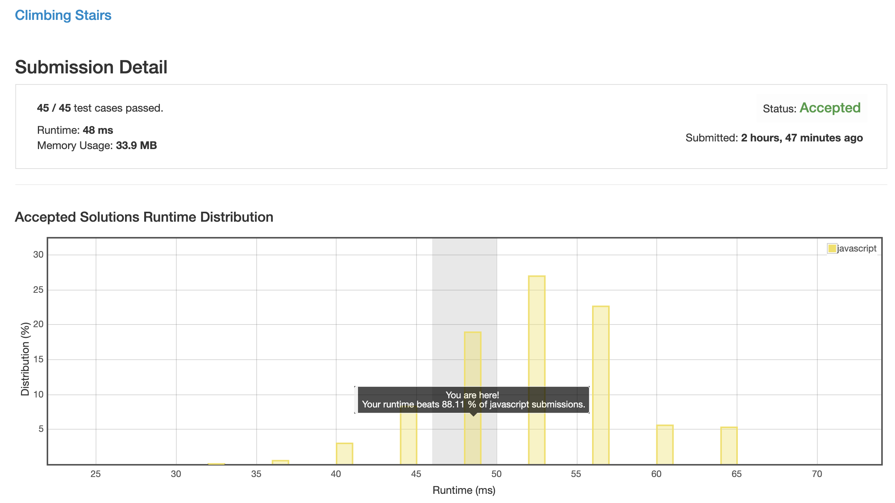
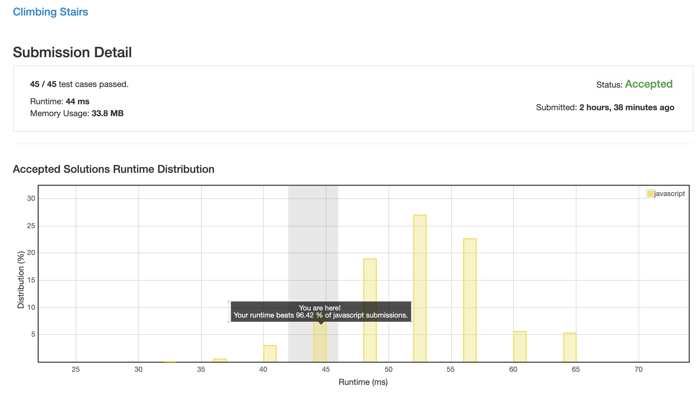

# 0070. 爬楼梯

本体本质就是斐波那契数列.

_我费了半天劲才到 44ms, 朋友直接用解法 2 就做到了 44ms, 这是个纯拼人品的题么?_

## 解法 1 ([accumulation.js](./accumulation.js))

本质就是模拟 `f(n) = f(n - 1) + f(n - 2)` 的过程.

## 解法 2 ([prediction.js](./prediction.js))

我试了下, 因为精度问题, js 的 case 就覆盖到了 45, 直接把结果计算好了放在那里取就好了.

分为使用 map 和 if-else 两种方法, 都差不多.

## 解法 3 ([hybrid.js](./hybrid.js))

因为直接用解法 2 的方法可能会因为前几次时只需要一到两轮计算就能得出结果, 比 `if-else` 声明结果性能消耗还要低, 所以在数字比较小的时候使用计算法替代掉来降低消耗.

