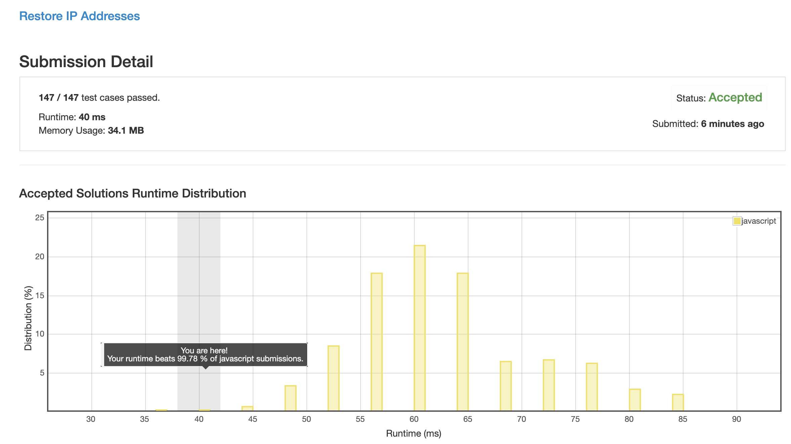

# 0093. 复原IP地址

随便写了一个就是效率最高的, 越优化越差, 我: ???

## 解法 1 ([recursion.js](./recursion.js))

IP 总共分为 4 段, 每段的规则都是 0 <= x <= 255.

也就是说每段的字符串 1 <= length <= 3 且转换为数字后满足上面的条件 (另外还有多位数时首位不能为 0).

所以字符串可以递归地分解为 1~3.1~3.1~3.1~3, 每位有 1 ~ 3 种分法 (长度为 1、2、3).

所以这里可以直接用穷举法进行递归, 在判断该位合理之后就从字符串中减去该位, 将剩余的投入下一次递归, 并且长度 -1.

这里比较重点的是根据当前剩余节数和字符串剩余长度确定当前位的长度.

```
Math.max(1, 字符串长度 - 节数 * 3) <= 当前长度 <= Math.min(3, 字符串长度 - 节数)
```

_Ps: 注意最大长度的 `3` 还要判断当前位长度若是 3, 则总值是否大于 255._

最后将递归的结果拼装起来就好了.


