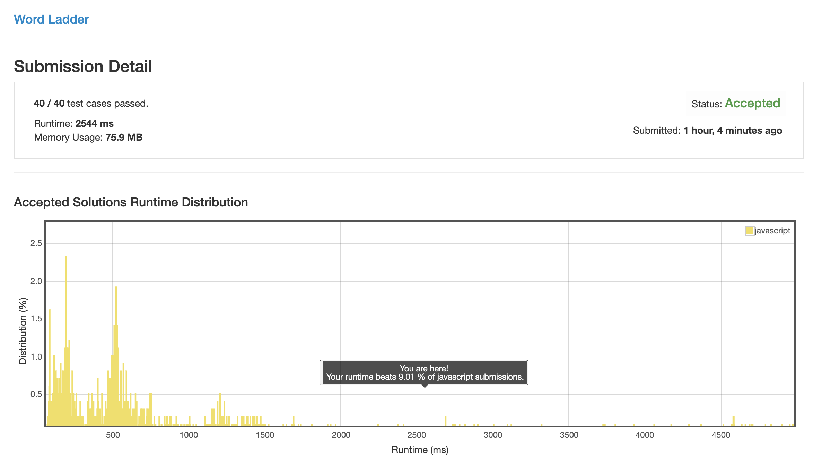
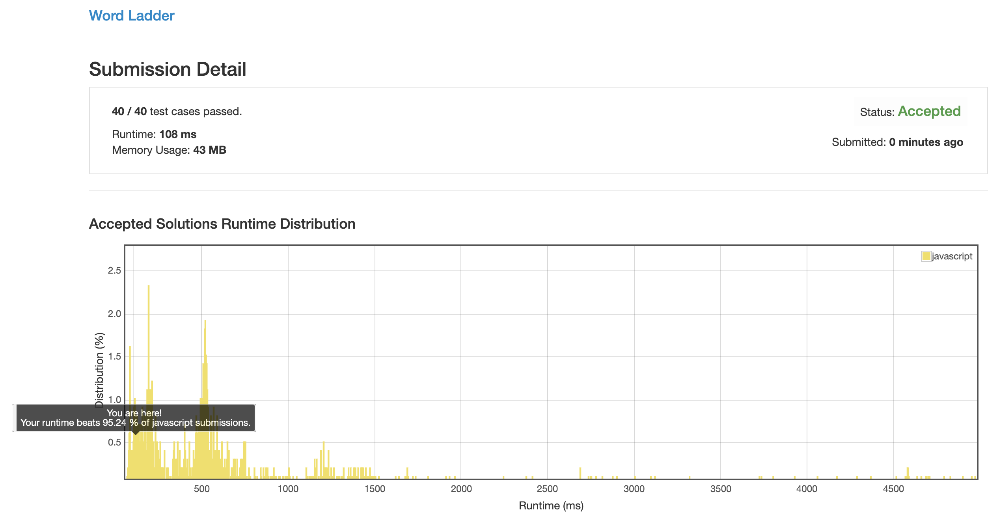

# 0127. 单词接龙

## 解法 1 ([dynamic-programming.js](./dynamic-programming.js))

最简单的动态规划算法, 计算关系矩阵, 从开始位置开始不断更新距离数据, 一直到最后的节点为止.

效率超级低, 字符串之间两两对比生成矩阵的复杂度就已经达到了 `n * n * l (长度) / 2` 的 O(n^2) 复杂度. 

## 解法 2 ([character-replace.js](./character-replace.js))

因为字母的可能性是有限的, 而且还很小 (26 个), 所以可以将问题转化为遍历这 26 个字母.

这样的话单次循环的最高复杂度也就只有 26 * l, 只需要控制遍历次数为 n , 便可将整体复杂度压缩到 26 * l * n, 也就是 O(n).

解决方法便是:

首先将 begin 和 end 分别置入两个 set 中, 其余的放入另一个 set 中.

对较短的 set 进行如下操作:

遍历其中内容, 逐个替换其中的字母, 并在剩余 set 中查看替换后的内容是否存在, 将存在的字符串存到一个新的 set 中.

这样做一次的时间复杂度是 26 * l.

整个 set 中的所有字符串的所有位置的字母尝试过所有的可能性后, 将当前 set 替换为刚创建的 set.

计数 + 1.

继续这个大循环.

整个 set 中的每个项只会被这么处理一次, 所以复杂度就是 n * l * 26, 比解法 1 快了很多.

### 思路来源

忘记了之前参考的谁了, 确实牛逼.

