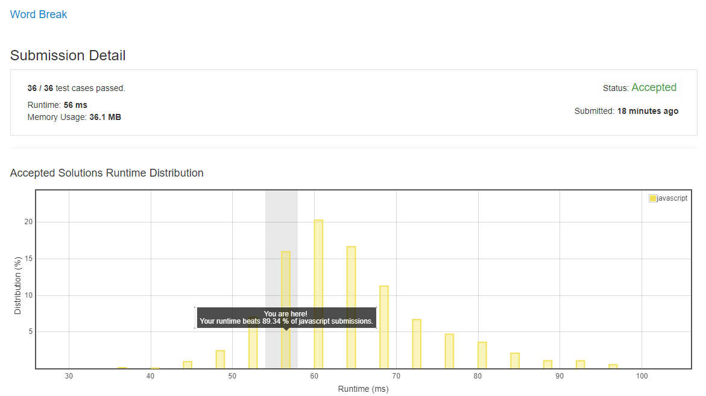

# 0139. 单词拆分

## 解法 1 ([dynamic-programming.js](./dynamic-programming.js))

1. 动态规划的算法, 搞一个 map, 存目前已处理好的字符串.

1. 只要这个 map 不为空, 就随便取一个出来, 逐个与单词进行首字母匹配, 并将匹配成功的结果, 删除匹配部分后插回 map 中.

1. 如果出现去除匹配部分后字符串为空的情况, 结果即为 true.

1. 否则运行到 map 为空, 则结果为 false.

_Ps: 试了下对已处理部分做缓存减少重复计算, 但感觉效果并不是很好._

