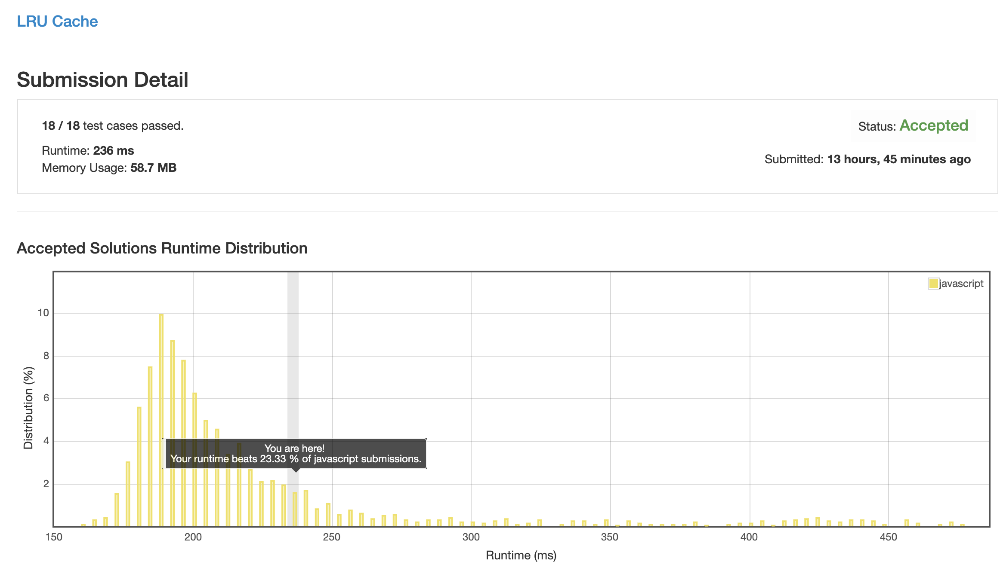

# 0146. LRU 缓存

## 解法 1 ([array-mark.js](./array-mark.js))

使用一个数组存放数据 (因为 js 中纯数字 key 用数组会有比 Map 还块的性能, 只是 size 要自己计算).

再用另一个数组存放调用记录栈, 每次有调用就找到对应记录, splice 并 unshift 到头部; 每次插入空间不足时就 pop 最后一项并在数据存储中 delete 该项.

## 解法 2 ([linked-list.js](./linked-list.js))

猜测上一步比较慢的原因可能是数组项目移动时需要将整个 0~n 段平移导致的, 所以将记录栈改写为链表来优化写操作效率.

没想到 js 的数组效率这么高以及对象声明的消耗这么大.

## 解法 3 ([timestamp.js](./timestamp.js))

既然数组操作不能用链表, 那直接将调用记录记录在数据里面可行么?

定一个自增 key, 每次读 & 写都会递增, 并记录在数据结构体里, 每次删除的时候全数组遍历一遍, 找最小删除.

当一个数组内部空位太多的时候, `forEach` 会比 `for` 循环效率更高.

## 解法 4 ([linked-list-plus.js](./linked-list-plus.js))

看到一个优化思路: 链表主要的性能消耗是遍历, 如果能建一个 map 来存每个节点的引用, 就可以将索引时间从 O(n) 缩减到 O(1).

而这个 map 又可以和数据的 map 合并, 直接用数据的 map 存储链表节点, 一举两得.

### 思路来源

[https://leetcode.com/problems/lru-cache/discuss/247060/Javascript-DoubleLL-%2B-Hashtable](https://leetcode.com/problems/lru-cache/discuss/247060/Javascript-DoubleLL-%2B-Hashtable)

