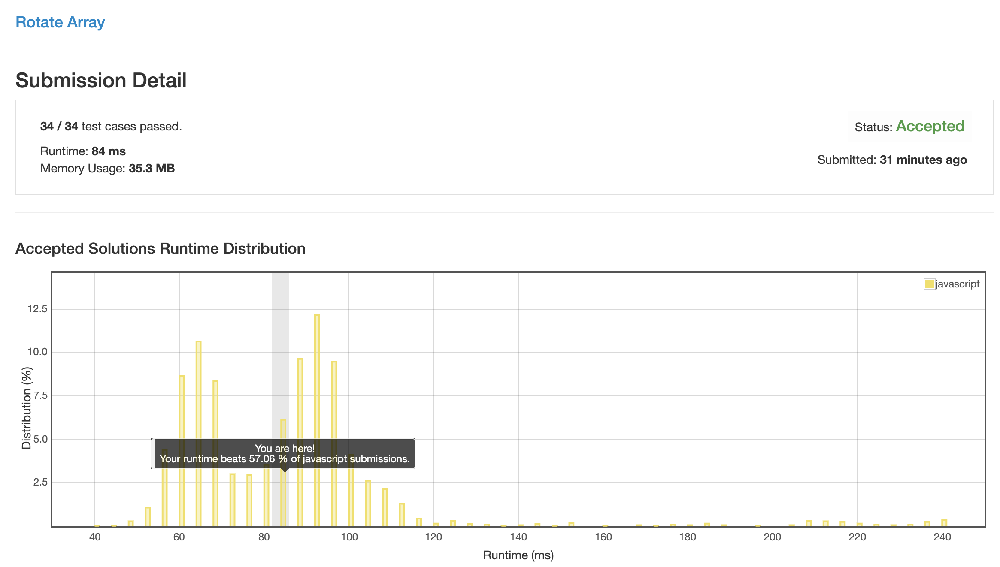
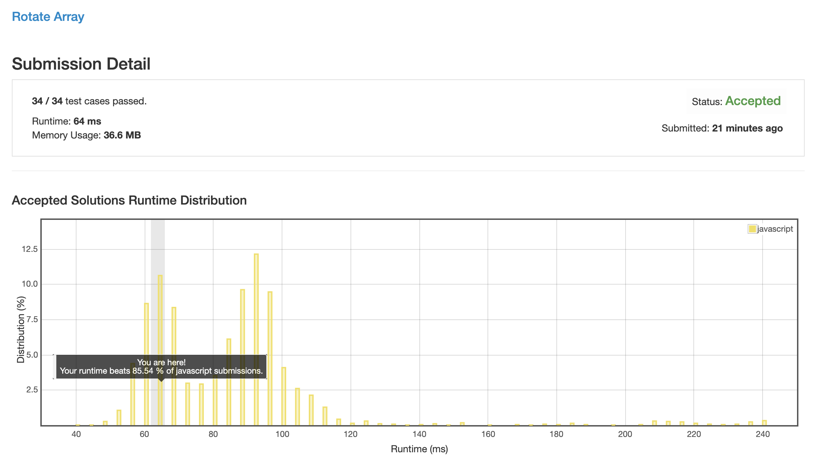
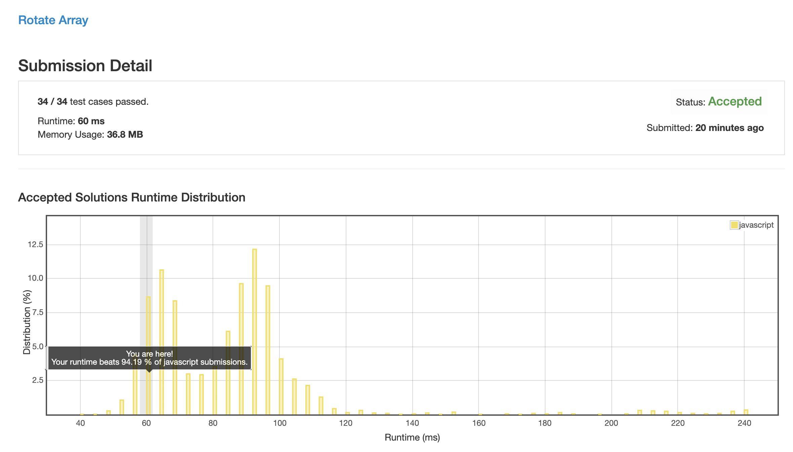

# 0189. 旋转数组

## 解法 1 ([array.js](./array.js))

非常弱智的 `pop` & `unshift`, 效率那自然是非常可怕了.

## 解法 2 ([calculate-position.js](./calculate-position.js))

通过一个函数来计算每个位置的值在交换后的下标, 将值移动过去, 并计算这个位置的目标位置.

一直循环直到回到开始位置.

这时向后遍历, 寻找下一个未被修改的值.

因为此题目不建议开外存, 所以这里可以在原位置做标记, 我试了下, 题目内数字的最大最小值是 32 位整数, 而 js 可以保证在 54 位以下时不丢失精度.

所以可以直接在每一位上都直接加一个 10000000000, 这样如果这个数字大于 10000000000, 就证明是被处理过的, 直接跳过, 将未处理过的值进行处理.

## 解法 3 ([hybrid.js](./hybrid.js))

上一个方法虽然提高了效率, 但还是没能到达极限.

我品了一下, 在移动位数较少的时候, 我的全数组遍历复杂度至少是 O(2 * n).

但如果用 `pop` & `unshift` 的话, 只需要一次数组平移就够了.

所以我这里直接拍脑袋定了个数字, 在 k 小于 3, 数组总长小于 20 的情况下, 使用 `pop` & `unshift` 加速.

