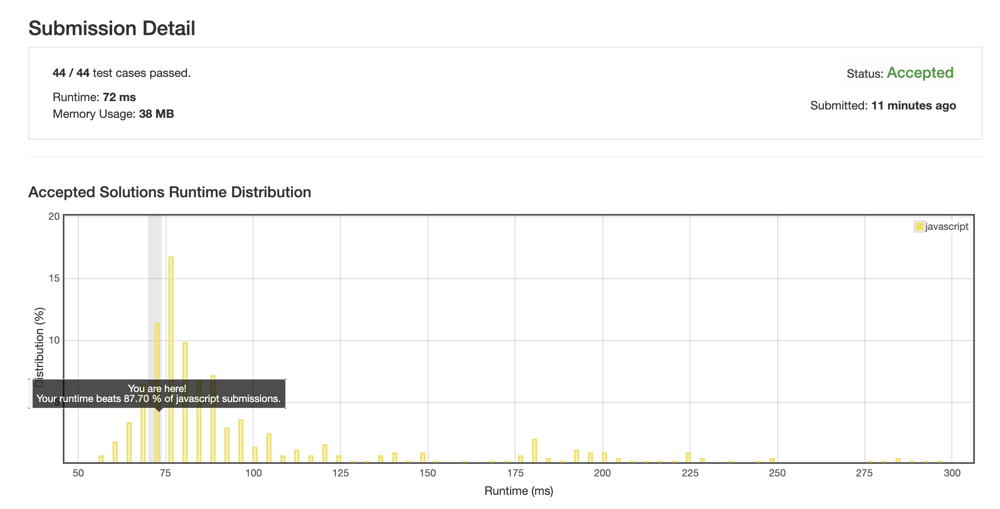

# 0210. 课程表 2

使用双向图做, 所有点存在一个数组里, 下标与 ID 一一对应.

`pre` 存该课程的依赖, `next` 存依赖该课程的.

所有节点构造完成后, 遍历寻找没有依赖的课程, 添加到结果中, 并将老列表中所有依赖该课程的依赖清理一遍.

不断循环, 直至无法找到没有依赖的课程.

此时若所有节点都被移出来了, 那就没问题, 如果还有节点没有被移出, 那就证明原列表中存在环状依赖, 直接按错误处理.

有效的规避了有向图中环判断的操作, 这玩意太难写了.

