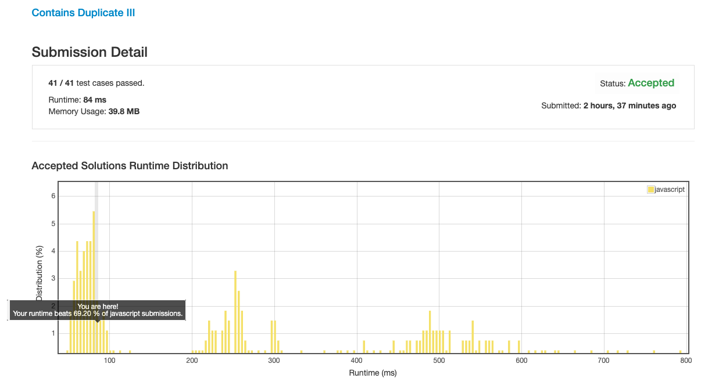
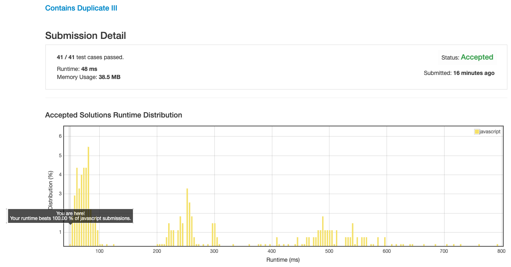

# 0220. 存在重复元素 3

## 解法 1 ([noob.js](./noob.js))

非常直观的做法, 建一个超大的 map, 把每个数字出现的位置都标记一下, 然后从头开始遍历有没有满足条件的.

经过疯狂的细节优化也没能超过 70% 的线, 止步于 69%.

## 解法 2 ([bucket.js](./bucket.js))

新建一个 `k` 大小的 map, 将数字变为整数当做 value (他的 java 版本是通过将数字转为 long 并减去最小的 int 值来转正的, js 只能通过减一个很大的数字来实现 (减去 `Number.MIN_SAFE_INTEGER` 就直接损失精度了, 我这里是 100 亿)).

将上方的 value 除以 `t` (为了防止 `t === 0` 的除数错误, 这里特地给 `t` 加了 `1`), 的值做 key.

判断 map 中是否有相同 `key` 的值, 若有, 则直接返回 `true`.

上面只判断了 `key * t ~ key * (t + 1)` 之间的值, 这里还需要再判断一下 `key * (t - 1) ~ key * t` 的值, 所以 `map[t - 1]` 也要取出来判断一下.

因为上面我们给 `t` 加了 `1`, 所以数值的范围不仅限于 `key * t`, 还要把 `key * (t + 1)` 也一并算进来, 看看被多除的部分有没有命中的值.

因为上面的区间包含了不覆盖的区域, 所以我们需要在判断里加一步:

取出 map 中的值, 与当前值相减, 判断差值是否小于 `t` (因为 `key * (t - 1)` / `key * t` / `key * (t + 1)` 的 key 与 value 是有序排列的, 所以这里也省略了取绝对值的步骤).

最后判断一下当前 map 存储量是否超过 `k` 了, 如果超过了, 那就把最早 set 进来的那一项删掉 (就直接取数组上那一项, 重新计算下 key 删掉就好了, 因为 k 值超过范围的值是根本没有计算价值的, 所以删掉了也无所谓).

然后把当前值 set 进去, 继续上面的循环.

### 思路来源

[https://leetcode.com/problems/contains-duplicate-iii/discuss/61645/AC-O(N)-solution-in-Java-using-buckets-with-explanation](https://leetcode.com/problems/contains-duplicate-iii/discuss/61645/AC-O(N)-solution-in-Java-using-buckets-with-explanation)

