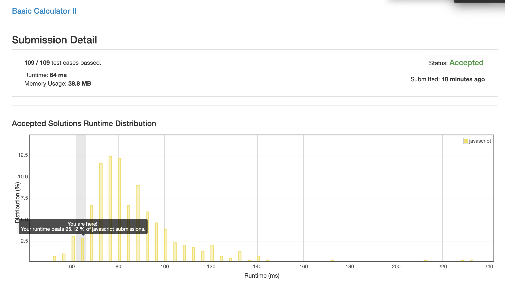

# 0227. 基本计算器 2

一开始想用文法分析解决, 后来看了一会之后发现那么做太复杂了, 真搞出来估计一是时间不允许, 二是时间肯定就炸了.

另外我自己还搞了个循环法, 跑三次循环, 第一次分词, 第二次乘除, 第三次加减.

跑到最后时间超了, 才意识到还是一遍遍历直接出结果比较快.

## 解法 1 (stack.js)

记录上个遇到的符号, 之后遇到数字就不断组装, 直到遇到新的符号后计算上个符号与当前数字的结果.

如果上个符号是加减, 直接把数字确定好符号后 push 进去即可.

如果上个符号是乘除, 需要把之前的结果 pop 出一项来, 计算出结果后再 push 回去.

### 思路来源

[https://leetcode.com/problems/basic-calculator-ii/discuss/63003/Share-my-java-solution](https://leetcode.com/problems/basic-calculator-ii/discuss/63003/Share-my-java-solution)
