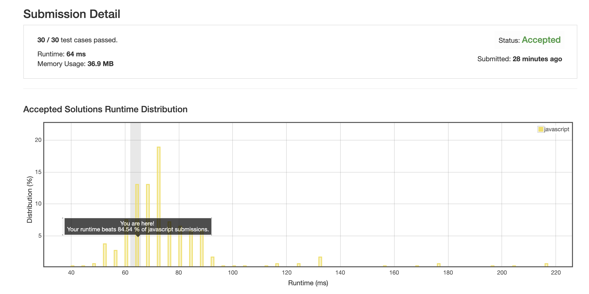
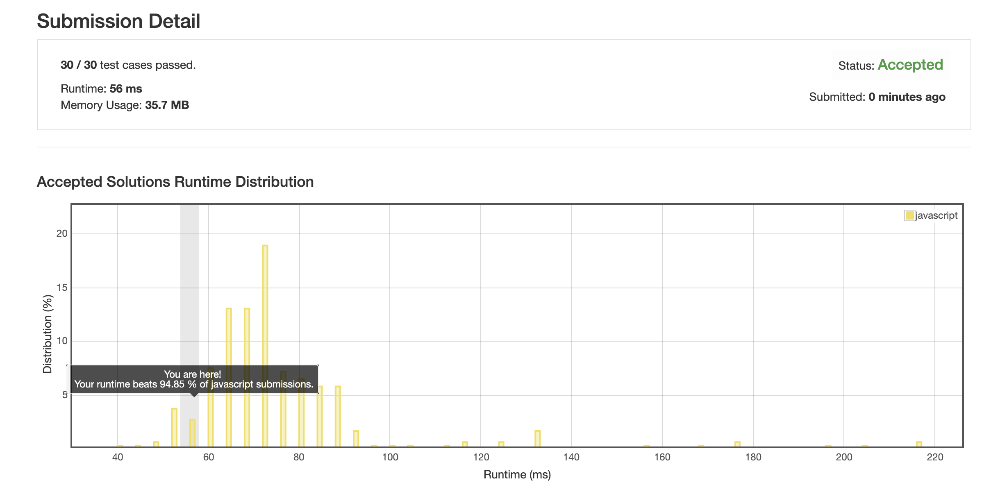

# 0260. 单个数字 3

## 解法 1 ([set.js](./set.js))

最简单的思路, 往 set 里塞数字, 没有就新增, 有就删除.

## 解法 2 ([xor.js](./xor.js))

异或操作同时满足以下三条性质:

1. A xor A = 0

1. A xor 0 = A

1. 交换律

由此可得:

A xor B xor C xor A xor B === C

原题中将所有数字全部 xor 一遍, 得出的结果即为单独的两个数字的异或值.

异或的本身含义即为: 参与运算的两个数字, 其相同位置上数字相同记为 0, 不同记为 1.

因而可以随便找最后异或结果中为 1 的某位, 使用该位单独做数字与数组中各位进行与操作.

结果为 1 归类到 groupA, 结果为 0 归类到 groupB, 这两个类别里的数字相互之间再进行异或.

因为相同的数字自然会被归类到同一组中进行抵消, 所以两个组中最后就会剩下这个当前两位不同的数字 A 和 B.

### 思路来源

英文版太多, 已找不到最初来源, 贴个中文解析:

[https://leetcode.com/problems/single-number-iii/discuss/277200/xor](https://leetcode.com/problems/single-number-iii/discuss/277200/xor)

