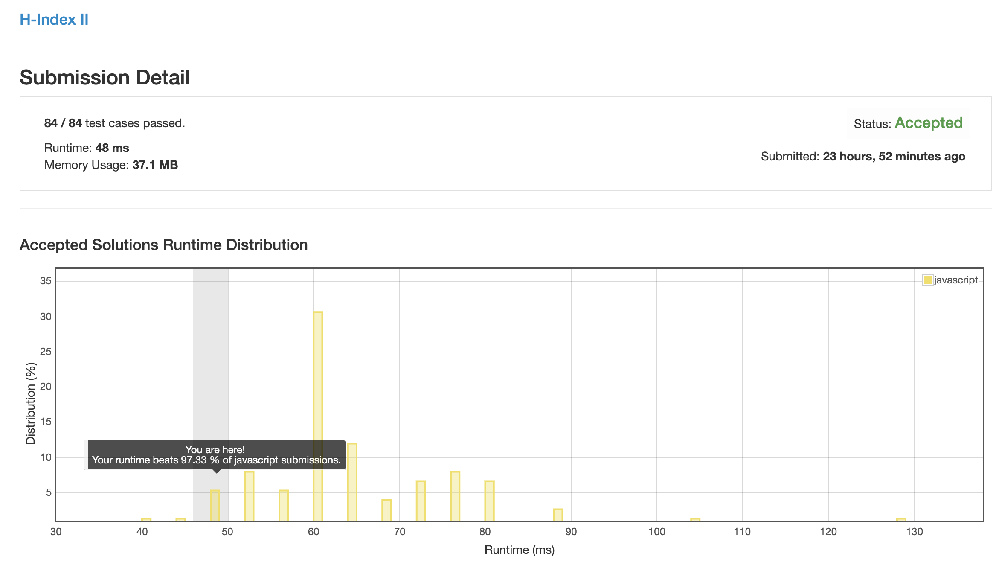

# 0275. H 指数 2

题目还是一样的难懂, 具体含义见 [0274. H 指数](../0274.h-index).

只是说这次数组已经是有序的了.

## 解法 1 (binary-search.js)

有序数组再用 map, 这样时间复杂度至少是 n, 就有点浪费时间了.

对于任何有序数组的查找操作, 都可以用二分查找进行优化, 用就行了.

### 思路来源

算数算了半天算不对, 最后去找了个这个直接抄过来了.

