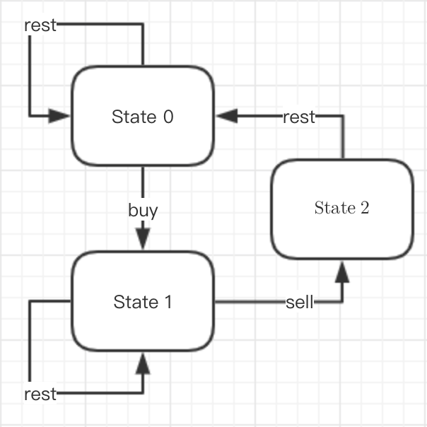
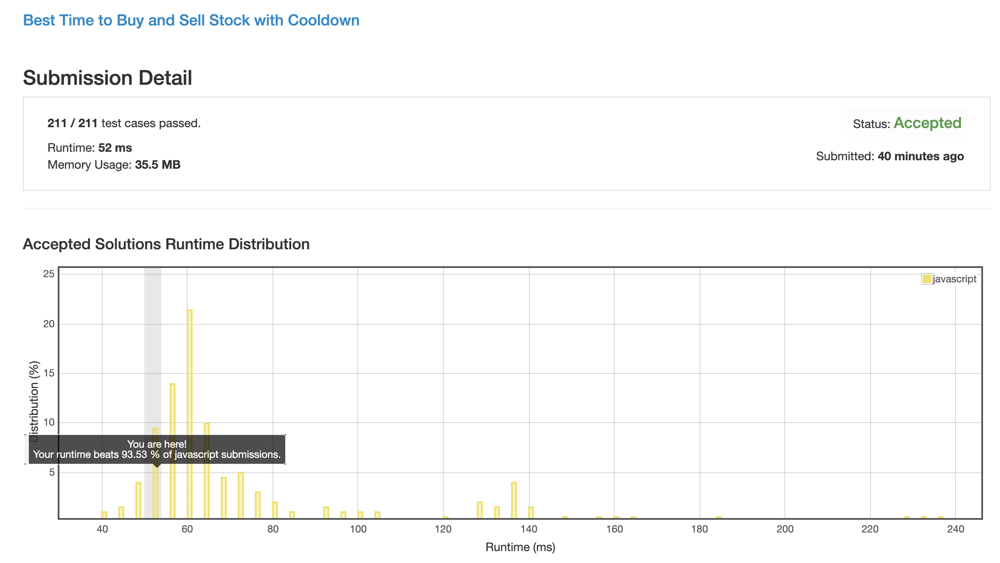
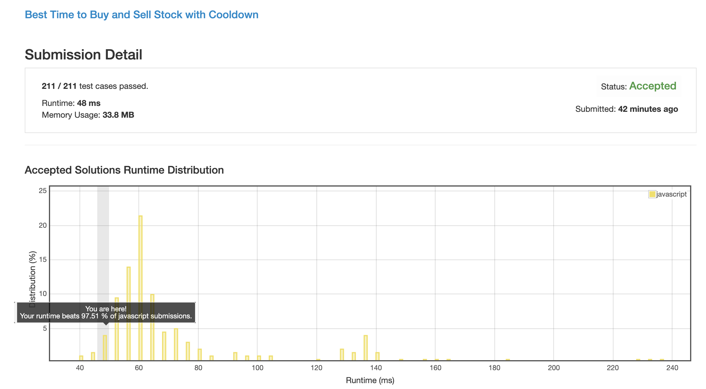

# 0309. 在有冷却时间时最佳的买卖股票时机

__TODO__ 还是有点不理解这个 max 为什么就能求出最优解

## 解法 1 ([dynamic-programming.js](./dynamic-programming.js))

这种叠加态的东西一看就是动态规划, 但具体如何做, 还是要先找状态转移公式.

我们发现:

1. 当我们手上没有股票的时候, 我们可以选择买股票, 或者继续等待

1. 当我们买了股票后, 我们可以选择卖出, 或是等待时机

1. 当我们卖出股票后, 需要强制休息一天, 在这之后就可以继续进入 买入 / 等待 状态了

根据这些, 我们可以绘制如下的状态图:

所以我们可以定义三个数组, 用于保存之前的状态, 并根据之前的状态做变化.

1. `s0[i] = max(s0[i - 1], s2[i - 1])`
 
1. `s1[i] = max(s1[i - 1], s0[i - 1] - price[i])` 

1. `s2[i] = s1[i - 1] + price[i]` 

最后求结果的时候, 因为买了没卖肯定是要扣钱的, 所以可以忽略.

直接比较剩下两个状态的值就 ok 了.

### 思路来源

[https://leetcode.com/problems/best-time-to-buy-and-sell-stock-with-cooldown/discuss/75928/Share-my-DP-solution-(By-State-Machine-Thinking)](https://leetcode.com/problems/best-time-to-buy-and-sell-stock-with-cooldown/discuss/75928/Share-my-DP-solution-%28By-State-Machine-Thinking%29)

[https://blog.csdn.net/zjuPeco/article/details/76468185](https://blog.csdn.net/zjuPeco/article/details/76468185)

### 优化点

其实我们最多只会使用到上次的状态, 所以搞个数组来存状态是十分没有必要的, 可以把数组简化成 `prev` `cur` 两个变量来减少内存使用.

似乎有办法将 s2 合并到 s1 中, 但这里我没看懂怎么合并的, 所以就先搁置了吧.

代码如下:

[dynamic-programming-plus.js](./dynamic-programming-plus.js)

### 思路来源

[https://leetcode.com/problems/best-time-to-buy-and-sell-stock-with-cooldown/discuss/75927/Share-my-thinking-process](https://leetcode.com/problems/best-time-to-buy-and-sell-stock-with-cooldown/discuss/75927/Share-my-thinking-process)

