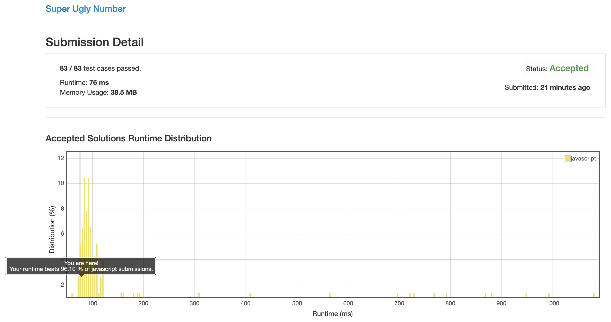

# 0313. 超级丑数

## 解法 1 ([index.js](./index.js))

这个题目主要的问题在于减少重复计算.

第 n 个丑数的值就是前 __几个丑数__ 互相的乘积中取一个最小的 (注意这里是有可能使用已有的丑数作为素材继续相乘得出新的丑数的).

而我们的每个丑数也都是由素材相乘而来的, 所以我们就可以通过使用素材数组不停乘丑数数组的方式来计算下一个丑数应该是多少.

这时为了尽量减少不必要的计算 (算出来当前丑数值之前的其他丑数值也都算是重复计算).

我们需要设置一些标志位, 来记录我们的每个素材数字 (primes 的内容) 乘到了哪里, 以减少前面那些不必要的计算.

题目要求第一位从 1 开始, 这也方便了我们的计算, 要不然到时候还要再删掉这个 1.

标记数组的初始值都是 0, 意为每个素材数字从第一个位置开始就没有乘过.

而后每次计算时, 就遍历素材数组, 将每个位置的数字, 与它上次乘到的位置相乘, 并在这些值中找到最小的那个值, 它就是这次的新丑数.

而后再遍历一遍素材数数组, 将所有能够乘出当前组合的数字的游标都向后推 1 (比如 3 和 5 都存在时, 新增加的丑数是 15, 这时 3 和 5 的游标都需要向后推一位).

### 思路来源

[https://blog.csdn.net/qq_23523409/article/details/84635857](https://blog.csdn.net/qq_23523409/article/details/84635857)

[https://leetcode.com/problems/super-ugly-number/discuss/76298/7-line-consice-O(kn)-c%2B%2B-solution](https://leetcode.com/problems/super-ugly-number/discuss/76298/7-line-consice-O(kn)-c%2B%2B-solution)

