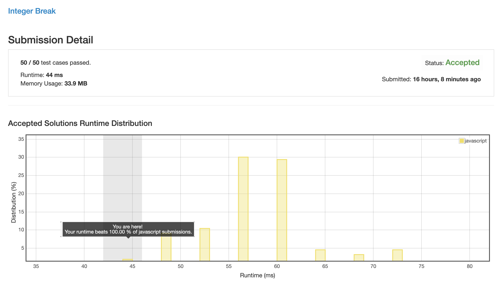

# 0343. 整数拆分

## 解法 1 (2-n-3.js)

在纸上计算了一下前 16 的值的最大结果, 得出一个结论: 所有数字的拆分后最大积都是由 2 & 3 相乘得出的.

原因分析:

~~任意和数都可以拆分为其他两数字之积.~~

~~&~~

~~质数不可拆分.~~

~~得~~

~~任意和数都可以拆分为 n 个质数的积.~~

~~所以我们将任何数字进行和值拆分时, 最终的结果都是拆分结果的质因数之积.~~

```
设有数字 A = a + b

当 a > b 时:
a + a > a + b
2a > a + b

∵ 已知 a > 2, b > 2
∴ ab > 2a
∴ ab > a + b
  
同理可得:
b > a 时, ab > a + b

当 a = b 时,

a + b = 2a
∵ 已知 a > 2, b > 2
∴ ab > 2a
∴ ab > a + b
```

综上所述, 当 a 和 b 均大于 2 时, 始终有 ab > a + b, 所以对于任何大于 4 的值, 将其拆分为两个大于 2 的数字都会比直接用它相乘要大.

大于 2 又小于等于 4 的值只有 3, 就疯狂拆 3 就好了, 最后 2 不够拆 3 补 2.


