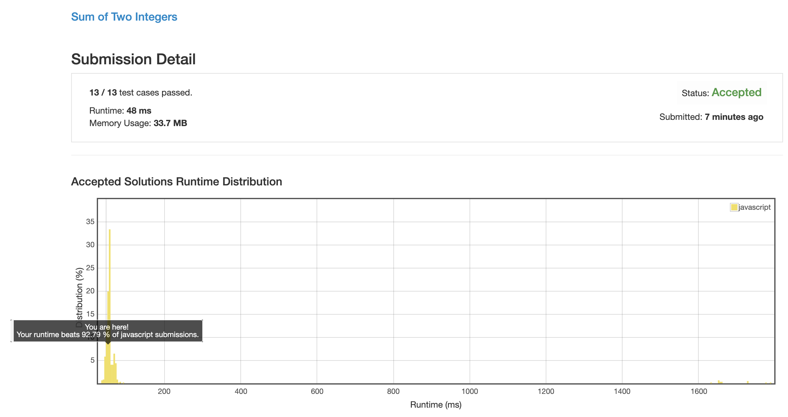

# 0371. 两数之和

## 解法 1 (binary.js)

两整数的加法, 可以通过如下位运算实现:

求两数的异或值:

同一位上如果同时是 0 或 1, 结果为 0, 模拟了 0 + 0 = 0 或 1 + 1 = 10;

如果一位为 0 一位为 1, 结果为 1, 模拟了 1 + 0 = 1.

不用担心丢失进位, 进位被保存在了下一个变量中.

```
T = A ^ B
```

求两数的且:

只有同时为 1 时才会为 1, 模拟 1 + 1 = 10 的进位, 留到下一位计算时使用.

```
Q = A & B
```

将进位向前推进一位, 移动到他们该进到的位置上.

不停继续这一循环, 直至进位为 0.


