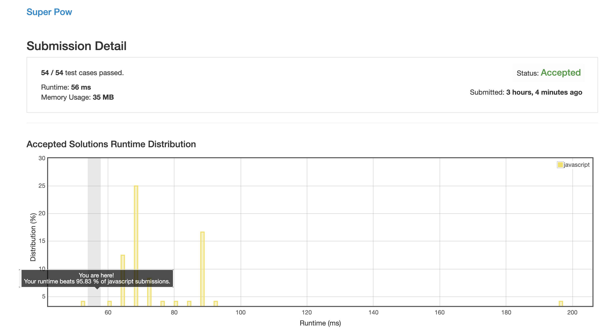

# 0372. 超级次方

公式实在太复杂了, 直接看的答案, 答案的公式我还理解了半天.

## 思路 1 (decompose.js)

取余的分解公式:

```
ab % k = (a % k)(b % k) % k
```

所以次方取余的分解公式:

```
  a^b % k 
=              (a^(b - 1) % k)(a % k) % k
= ((a^(b - 2) % k)(a % k) % k)(a % k) % k
...
= (((a % k)(a % k) % k)(a % k) % k)(a % k) % k
```

预计算 `c = a % k`:

```
((((cc % k)c % k)c % k)c % k)c % k
```

上面这个计算过程超级累并且可以复用, 所以就直接封装成一个子函数.

高次方取余的分解公式:

```
  a^bcde % k
=     (a^bcd0 % k)(a^e % k) % k
= ((a^bcd)^10 % k)(a^e % k) % k
```

此时可以将 a^bcd 看作一个整体, (a^bcd)^10 % k 可以看作 对 a^bcd 的 10 次方取 k 的余数.

将此数值代入原函数中继续求值, 后面就不断递归就好了.

### 思路来源

[https://leetcode.com/problems/super-pow/discuss/84472/C%2B%2B-Clean-and-Short-Solution](https://leetcode.com/problems/super-pow/discuss/84472/C%2B%2B-Clean-and-Short-Solution)


