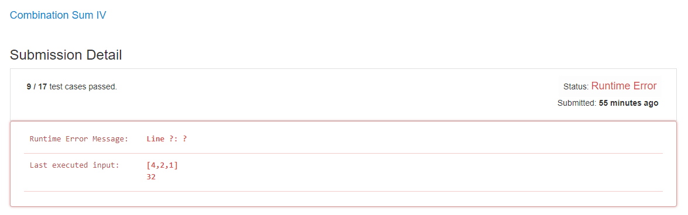
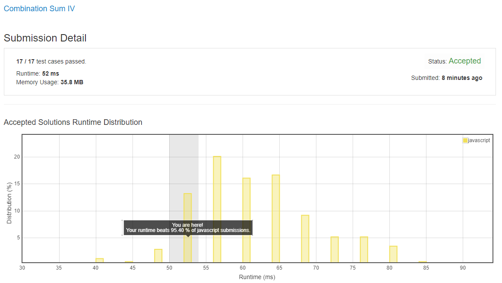

# 0377. 组合总和 4

## 解法 1 ([tree.js](./tree.js))

这个题要求不同的组合顺序也算不同的 case, 所以不能用简单的累加, 这里就用树模拟了每次拿新数字的情况, 一直到全部 case 和值都超过 target 为止.

结果最后算超时了.

## 解法 2 ([dynamic-programming.js](./dynamic-programming.js))

因为上面的超时了, 所以我改用数组 + 动态规划的算法来改写上面的 case, 但还是超时了.

后来我想明白了, 这里虽然区分不同顺序的 case, 但并不在意 case 的详情, 所以将动态规划的数组中的 case 数组, 直接压缩成了 case count, 这次终于不再超时了.

并且将整个循环进行更进一步的摊平, 将原本的 `while (和值数组不为空) { 和值 * 硬币列表 }` 的循环简化成了 `while (和值数组不为空) { pick 第一个和值 * 硬币列表 }` 的循环, 减少了不必要的循环.

再经过一定的优化, 前 10%!

