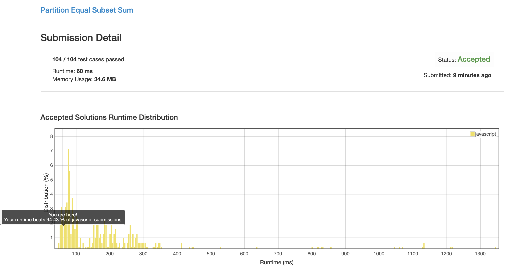

# 0416. 分割等和子集

> Ps: 因为这个题目的本质就是背包问题, 所以我就把数字叫 "石头" 了, 意思差不多 

## 解法 1 ([dynamic-programming-01.js](./dynamic-programming-01.js))

非常经典的动态规划问题, 可以把整个问题分解为:

当我拿前 n 块石头时可以满足哪些情形?

而前 n 正好就可以分解为:

前 n - 1 块石头可以满足哪些情形?

\+ 

拿起第 n 块石头来之后, 能再新增哪些场景?

是一个标准的 `dp(n) = dp(n-1) + dp(n-2)` 问题.

所以生成 dp 表, 第一维坐标为放第 n 块石头, 第二维为第 n 块石头的情境下, 每个重量 (1...n) 是否能满足.

这样就开始进行一个二维的遍历, 第一维为石头列表, 含义就是新增一块石头.

第二维为放 n 块之后的总重 case, 遍历逐个计算我把这块石头放进来之后哪些 case 能满足, 具体计算方法为: 

```
当前 case 是否可达成

= 

相同重量下, 上一次 (少放一块石头时) 能否达成

or

上一次 (少放一块石头时), 是否有情景满足: (当时的重量 + 我现在要加的这块石头的重量 === 当前 case) 
```

以上条件满足任何一条, 当前 case 就可以达成.

最后整个表计算完后, 看看下标为 `[sum]` 的 case 是否是 true 就 ok 了

### 思路来源

[https://leetcode.com/problems/partition-equal-subset-sum/discuss/90592/01-knapsack-detailed-explanation](https://leetcode.com/problems/partition-equal-subset-sum/discuss/90592/01-knapsack-detailed-explanation)


## 解法 2 ([dynamic-programming-02.js](./dynamic-programming-02.js))

### 优化点

1. 仔细观察了下结果矩阵, 发现一个规律, 一旦某一次某个 case 满足了, 那么它下面的 (+1 石头 +2 石头 +3 石头 ...) 所有 case 也都会满足.

    这主要是因为 `matrix[i][j] = matrix[i - 1][j] || ...` 造成的.

    从含义上讲, 当 n 块石头可以组合成某种 case 后, 石头更多的情况下, 那么这个 case 仍然是满足的 (只要我不把石头搬进来).

    所以可以将整个数组压缩成一维数组, 每一位就表示当前 case 是否满足就好了.
    
1. 这样提交之后没有 ac, 又重新打印了一下最终的数据结构, 发现基本全都是 true 了.

    所以进入逐步调试, 发现当石头比较小的时候 (1 / 2 / 3), 遍历的时候会出现这么一个问题:
    
    到 case 2, 因为满足 0 + 2, 所以置为 true; 再到了 case 4, 会因为刚刚 case 2 已经被搞成 true 了, 所以百分百也是 true, 从而污染了整个列表.
    
    所以这里为了防止这种叠加问题, 就只好倒序遍历每个 case 了.
    
1. 运行之后效率并不是特别理想, 返回头去查以前的写法 (因为上一种方法我有一种方法稳定在了 150ms 而另一种则一直是 200ms), 寻找性能难点.

    对比了两份代码, 发现新建数组的时候, 提前声明好数组长度, 会比不声明数组长度, 然后每次 `array[x] = 1` 效率提升 1 / 3. (具体原因请见: [TIPS#javascript 数组](../TIPS.md#javascript-数组))

    加了之后, 发现成绩还是没能进入前 10%, 重新审视代码, 此时的优化重点主要放在循环上, 力求降低循环次数. 
    
    发现了两个问题:
    
        1. 我的倒序遍历 (内层循环), 到达比当前石头重量还小的 case 时就不应该继续计算下去了 (毕竟不能把石头掰碎了不是?) 
    
        1. 我的循环无论如何都会一直运行到全部算完为止, 因为总共有 n 块石头, 而很多情况下少两三块石头的时候结果就已经算出来了
        
            那么那么这时便会有不必要的计算产生, 所以将判断 true false 的判断前移, 从而尽量减少不必要的循环
         
1. 请忽略我最后搞了个 Uint8Array 
            
在疯狂的优化下, 我的成绩终于进入了前 10%:


