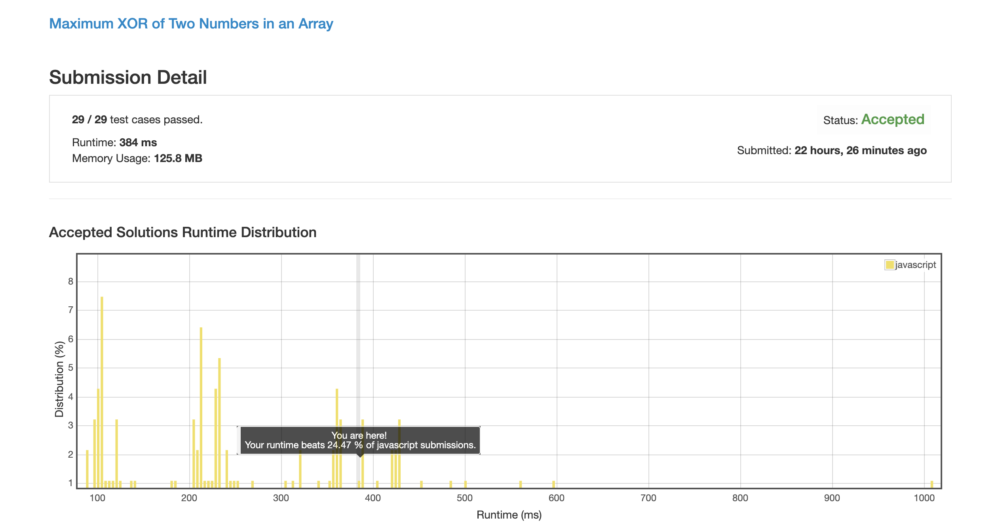
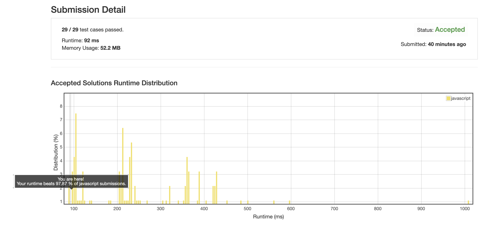

# 0421. 在给定数组中求最大的两数异或值

## 解法 1 (tree.js)

将给定的数组转化为高度为 32 的二叉树, 每一位均对应数字二进制格式的一位, 每个节点的两子树分别为 0 和 1, 指向数字的下一位.

生成树后再次遍历数组, 将数组的每一项中的值带入树中, 本着节点有哪边走哪边, 两边都有就走当前位不一样的规则, 走出当前数字与列表中的其他数字进行异或时能取到的最大值.

最后就能从结果中找到最大的数了.

### 思路来源

[https://leetcode.com/problems/maximum-xor-of-two-numbers-in-an-array/discuss/130427/()-92](https://leetcode.com/problems/maximum-xor-of-two-numbers-in-an-array/discuss/130427/()-92)

原答案是 java 的, 可能这个解法在 java 下效率比较高吧.

[https://blog.csdn.net/woshinannan741/article/details/51985368](https://blog.csdn.net/woshinannan741/article/details/51985368)

CSDN 这个说的是一样的思路.

### 优化点

本解法写完后只能打败 20% 的人, 可见解法效率极其低下.

个人认为问题主要出在几个地方:

1. 二进制数字生成效率太低, 在生成树的阶段通过 map 缓存二进制结果, 在计算异或值的阶段直接取值, 节省计算时间.

    结果: 无效

1. 数字一般不会太大, 树的前半段基本都是在浪费时间, 求出树的最大高度 (数组最大值的高度最大) 之后直接从那个值的高度开始构造树.

    结果: 无效
    
1. 在查找树的时候遇到数字过分小 (比如第二位开始就是 0) 的情况时, 应该直接结束, 不要再浪费时间了.

    结果: 太麻烦了, 没试
    
1. 给定的用例大小都太小了, 本解法的复杂度为 o(32 * 2 * n). 如果数组太小, 32 就成了比较大的值了.

    结果: 按照刚刚 2 中的结论, 看来树深度并不是大问题.
    
1. 树结构的对象生成太费时间, 如果有平凡的数组方式会简单很多.

    结果: 那就直接换个方法吧.
    

## 解法 2 (step-by-step.js)

本解法的根本思路在于: 

1. 任何一个数字在二进制格式下, 高位上是 1 的数字比低位是 1 的数字 (甚至低位全都是 1 的数字) 大.

1. 将两个数字进行异或操作, 得出来的值与之前的两个值互为异或关系

根据 1:

按位比较数字, 当高位对比后已经有结果之后, 低位就不需要比较了.

所以也就可以先把低位全部遮上, 从高位开始逐位求当前的最大异或值. 在高位最大的情况下求低位的最大, 至此将局部最大扩散到整体最大.

根据 2:

可以先将全部数字塞入一个 set, 假设一个最大的异或值, 遍历这个 set, 假设 `最大值 xor 当前值` 的值存在于 set 中, 则可证明当前 set 中的值进行异或能够获得该最大异或值.

根据 1 & 2:

从高位开始, 逐位进行:

1. 使用遮罩层, 过滤掉每个数字在当前处理位之后的位值.

1. 将值塞入 set.

1. 假设 `前一位计算出的最大值 + 当前位为 1 其他位为 0 的值` 时的值为最大值.

1. 与 set 中每个数字进行异或操作, 如果结果也存在于 set 中, 证明当前位可以为 1, 将最大值记为当前位为 1 时的值.

1. 如果没有任何一个值满足上一步要求的条件, 该位为 0, 不进行任何操作, 直接进入下一位的计算.

(因为每一步的异或操作都是在满足两个数字都在 set 中才会更新最大值的前提下进行的, 所以也不需要担心出现位蹿动的问题)

### 思路来源

javascript 版本:

[https://leetcode.com/problems/maximum-xor-of-two-numbers-in-an-array/discuss/289178/Javascript-O(n)-solution-using-bit-manipulation-and-HashMap-(beat-100)](https://leetcode.com/problems/maximum-xor-of-two-numbers-in-an-array/discuss/289178/Javascript-O(n)-solution-using-bit-manipulation-and-HashMap-(beat-100))

java 版本 (源版本):

[https://leetcode.com/problems/maximum-xor-of-two-numbers-in-an-array/discuss/91049/Java-O(n)-solution-using-bit-manipulation-and-HashMap](https://leetcode.com/problems/maximum-xor-of-two-numbers-in-an-array/discuss/91049/Java-O(n)-solution-using-bit-manipulation-and-HashMap)

中文解释:

[https://blog.csdn.net/woshinannan741/article/details/51985368](https://blog.csdn.net/woshinannan741/article/details/51985368)

