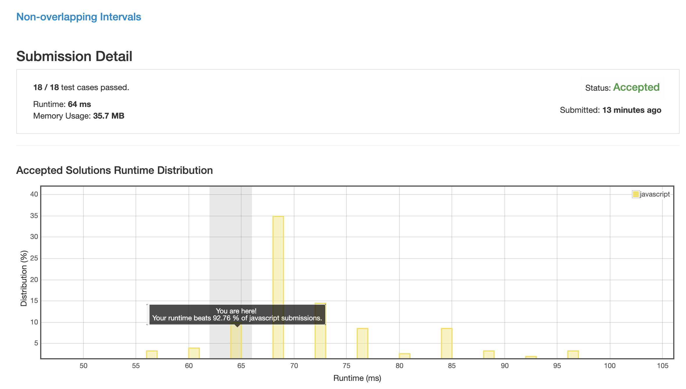

# 0435. 无重叠区间

## 解法 1 (loop.js)

既然是求最大数量那么只要用贪心就够了, 但关键在于如果定义循环, 使用 end 作为排序依据进行排序.
 
乍一看可能会担心 start 不排序造成中间路径被覆盖的问题.

但我们无需担心这个问题, 因为:

如果要满足某一节点可被两其他节点替代的情况, 那么它们需要满足:

littleA.end > big.start && littleB.start < big.end

这时就会存在 littleA.end < big.end

既然整个数组是由 end 从小到大进行排序的, 那么 littleA 一定会比 big 先入队列, big 会因为入队列时已存在重复频段而失败.

