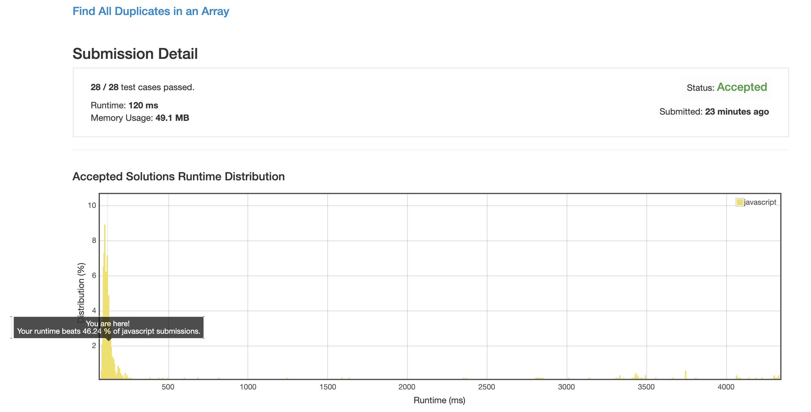
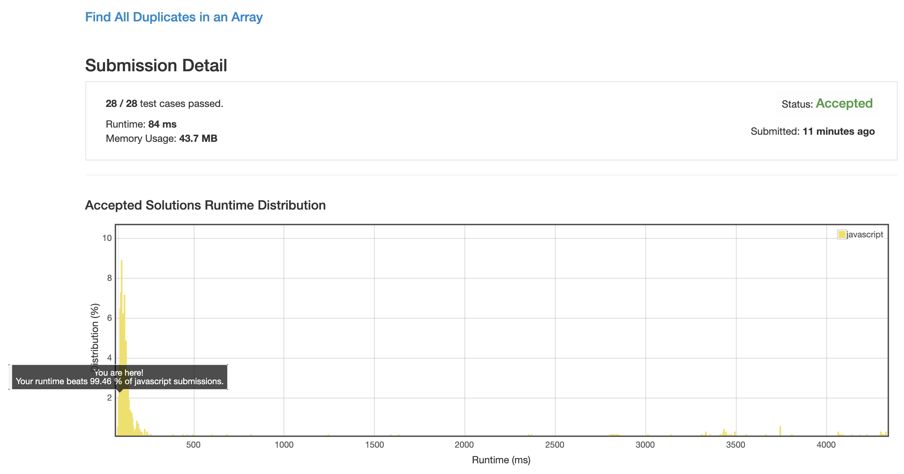

# 0442. 找出数组中所有重复的数字

先排序再遍历 和 直接搞个 map 进行标记, 这两种方法都不如我的方法快.

## 解法 1 ([swap.js](./swap.js))

我自己的解法, 比较简单, 就是设置一个游标, 不断向后推进.

当遇到当前内容数字与游标不一样的时候, 就把当前数字换到它应该在的位置.

如果换过来的数字还不匹配, 就继续再把这个数字扔到对应的位置.

直到目前位置数字匹配.

如果交换过程中遇到了目标位置数字已经匹配了 (也就是说当前位置是多余的), 就把这个数字记入结果中.

最后返回结果.

_Ps: 内存使用打败了 50% 的人_

## 解法 2 ([negative.js](./negative.js))

既然不让额外开存储空间, 那就直接拿原数组当存储空间.

标记的时候只改变目标位置的符号, 这样就可以通过正负来判断标记.

