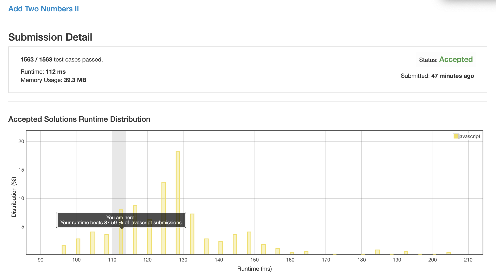
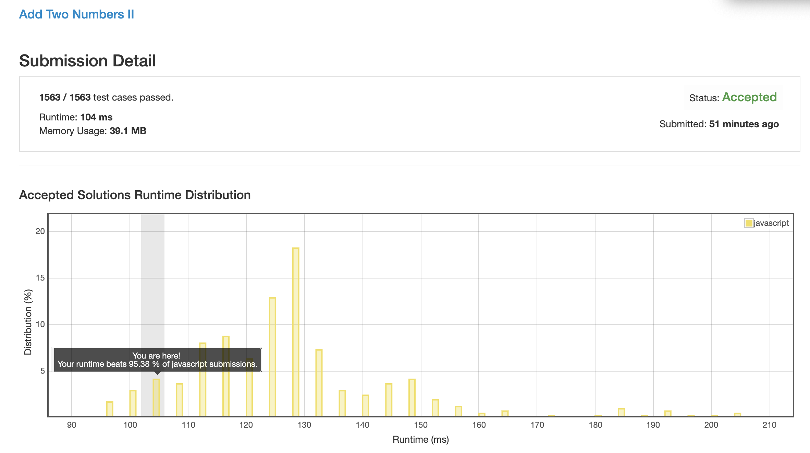
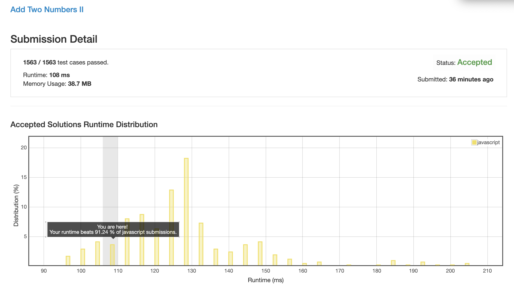

# 0445. 两数相加 2

## 解法 1 ([stack1.js](./stack1.js) & [stack2.js](./stack2.js))

最直白的做法, 直接读两个链表, 将内部数据全读出来然后一个一个加起来, 形成新链表.

### 优化点

直接生成个新的链表可能性能消耗比较大, 那么我直接复用原链表, 应该会减少很多性能损耗.

经过测试, 发现了一个神奇的结论:

1. stack 中存节点对象, 直接在原链表上改的效率.

1. stack 中存节点 val 值, 后面通过修改节点的 next 值翻转整个链表前后顺序.

1 & 2 两种方法里, 竟然是第二种的效率更高. 我猜大概是因为对对象的引用进行数组 push pop 操作的消耗太大导致的.

## 解法 2 ([recursion.js](./recursion.js))

仔细想了想感觉上面的做法还是有点弱智, 很浪费空间代码还不好看.

这个问题既然是一个单向的链表, 那么就一定能用递归做.

我这里唯一的问题就是怎么知道两个单向链表的长度差.

我这边偷了个懒, 直接遍历解决的, 但我知道一定会有更好的办法缓存住两边的遍历状态, 然后从底部开始向上解递归.

等以后找到更好的做法了再说吧.

整体思路就是:

1. 计算两边长度差值

1. 两个链表带差值传入递归中
 
1. 递归判断差值:
 
    + 一长一短: 长的一端的值 = 长的一端原值 + 递归 (长的一端.next, 短的一端, 差值 - 1) 的返回值
    
        如果和大于等于 10, 取余返回 1, 否则返回 0
    
    + 长度相等: 两端同时赋值 = 端 A 的值 + 端 B 的值 + 递归 (端 A.next, 端 B.next, 0)

        如果和大于等于 10, 取余返回 1, 否则返回 0

1. 这样最后长的那根链表就是最终的结果了, 直接返回

