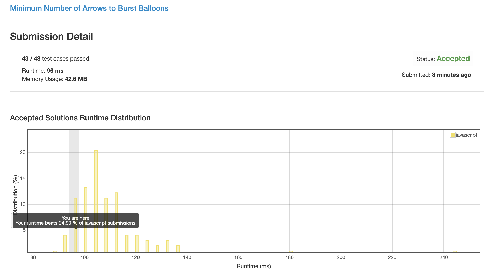

# 0452. 用最少的弓箭射爆气球

我试了 dp 还有标记法, 全都超时了, 事实证明贪心并不垃圾, 只是应用面比较窄而已.

## 解法 1 ([greedy.js](./greedy.js))

因为无论如何, 排在端点的气球都需要被射爆.
 
所以本题使用贪心, 求解在射爆端点气球时找到能同时射爆最多其他的气球的 case, 来当做每次的射入点, 最终求得全部气球都被射爆的总射击次数.

将所有的气球按照结束位置从小到大进行排序, 第一个气球就是我们要射爆的第一个目标, 因为它的结束值最小, 任何大于这个值的射入点都无法射爆该气球.

遍历整个数组 (因为已经排好序了, 所以很快), 一直到第一个左端点比这个值大的气球为止, 已经被遍历到的气球都是会被该次射击引爆的气球.

计数加一, 然后以下一个气球的右端点为起始继续上述流程.

### 思路来源

[https://leetcode.com/problems/minimum-number-of-arrows-to-burst-balloons/discuss/93703/Share-my-explained-Greedy-solution](https://leetcode.com/problems/minimum-number-of-arrows-to-burst-balloons/discuss/93703/Share-my-explained-Greedy-solution)

