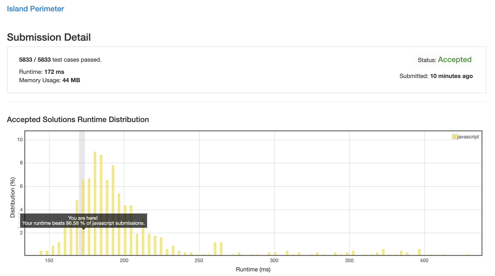
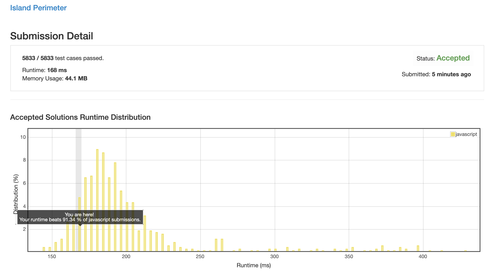

# 0463. 岛屿的周长

## 解法 1 ([accumulation.js](./accumulation.js))

很简单, 遍历每一块, 默认 +4, 左边有一块就 -2 (减去左边块已经加了的部分 & 本块不能加的部分), 上面有一块也 -2 (同上).

最后的和就是结果.

## 解法 2 ([formula.js](./formula.js))

上面的方法已经是最简了, 最后实在没办法了去找的解法, 思路就是每一块陆地有 4 个边, 每有一次相邻就会减少 2 个边 (跟上面一个解释).

所以统计总共多少块还有多少个相邻, 最后 `块数 * 4 - 相邻次数 * 2` 就是要求的结果了.

### 思路来源

[https://leetcode.com/problems/island-perimeter/discuss/95001/clear-and-easy-java-solution](https://leetcode.com/problems/island-perimeter/discuss/95001/clear-and-easy-java-solution)

