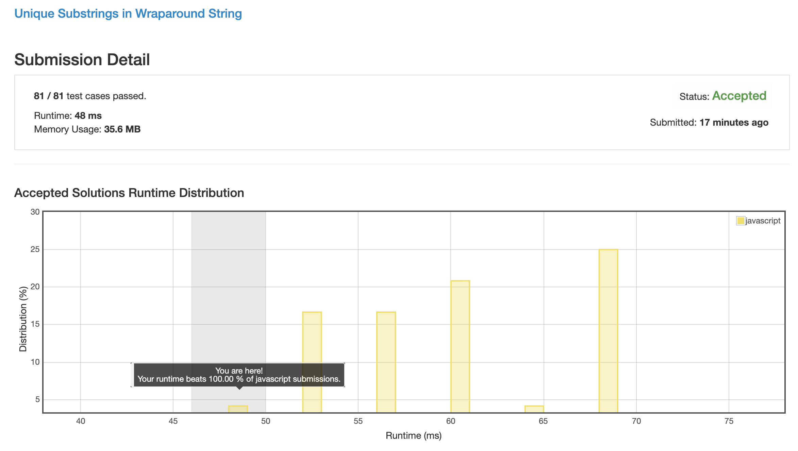

# 0467. 环形字符串中的独立子字符串

## 解法 1 ([dynamic-programming.js](./dynamic-programming.js))

要想做明白这道题, 首先要明白两个规律:

1. 任一字符串, 其不同连续子串的数量为 `1 + 2 + 3 + 4 + ... + n`, 图形化理解如下:

    ```
    a b c d
    1 1 1 1  -- a / b / c / d
     1 1 1   -- ab / bc / cd
      1 1    -- abc / bcd
       1     -- abcd
    ```

    所以可以理解为: 连续的字符串每增长 1 的长度, 整体 case 的数量就会增加该串最大长度 n 的大小.

1. 本题目中所求的是不同 case 的总个数, 所以说在不同位置出现相同 case 时应该合并, 不要重复计数. 

    而本题只有一种匹配模式, 那就是 `abcdefg...`, 所以说结尾相同的字符串, 大的总会包含所有小的中的 case (开头相同的也一样, 只是这里结尾相同比较好写代码), 图形化理解如下:

    ```
      b c d
      1 1 1  --     b / c / d
       1 1   --      bc / cd
        1    --       bcd
        
    a b c d
    1 1 1 1  -- a / b / c / d
     1 1 1   -- ab / bc / cd
      1 1    -- abc / bcd
       1     -- abcd
    ```

所以我们的整个计算过程, 便只需要求以每个字符串结尾的最大连续子串长度就可以了.

### 优化点

JS 里字符串的减法十分反人类, 所以搞了个单独的 cache 数组来缓存 `charCodeAt` 的结果.

另外由于数字都是小正数, 所以我这里直接就用 `Uint8Array` 之类的来加速数组操作 (和减少初始化工作量) 了.

### 思路来源

[https://leetcode.com/problems/unique-substrings-in-wraparound-string/discuss/95439/Concise-Java-solution-using-DP](https://leetcode.com/problems/unique-substrings-in-wraparound-string/discuss/95439/Concise-Java-solution-using-DP)


