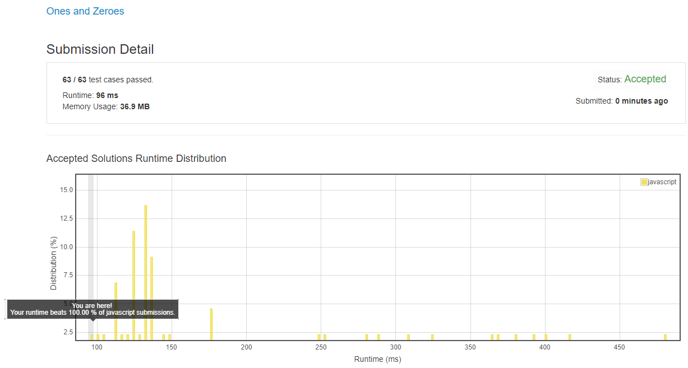

# 0474. 1 和 0

## 解法 1 ([dynamic-programming.js](./dynamic-programming.js))

创建一个 m * n 的矩阵, 用于保存 m 个 0 和 n 个 1 的时候, 最多能组成多少个字符串.

遍历每个字符串, 更新矩阵的每个位置, 更新方法为:

取当前值与 `(m - {0 的个数}, n - {1 的个数}) 位置 + 1` 的值中更大的一个赋值到当前位置.

最后 `matrix[m][n]` 的值就是结果

### 思路来源

[https://leetcode.com/problems/ones-and-zeroes/discuss/95814/c%2B%2B-DP-solution-with-comments](https://leetcode.com/problems/ones-and-zeroes/discuss/95814/c%2B%2B-DP-solution-with-comments)

