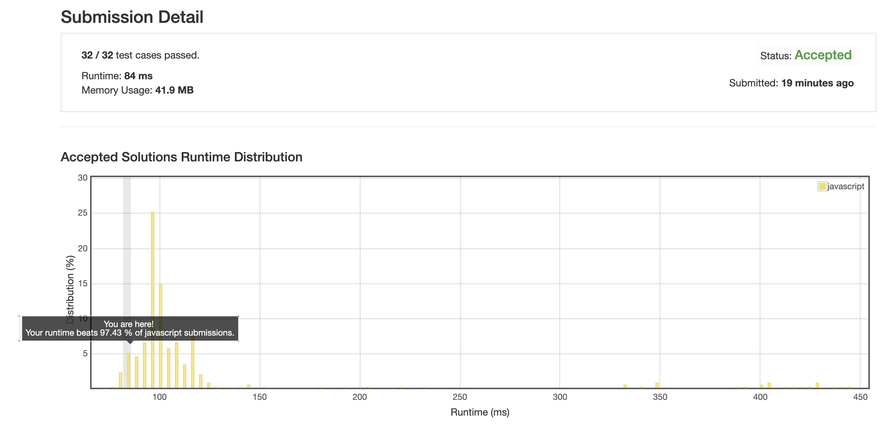

# 0498. 对角线

暴力解法, 直接模拟遍历的过程.

(按理来说下标应该是有公式的, 但是我没算出来, 直接用暴力破解复杂度也是 O(n) 的, 没什么大问题)

重点:

当到达右端或下端时, 需要根据具体情况判断应该平行移动还是斜向移动:

_注: 奇偶计算从 0 开始_

1. 纵向为奇数时, 到达底端后, 偶数列斜向, 奇数列横向.

    ```
    ↗ ↙ ↗ ↙
    ↙ ↗ ↙ ↗
    ↗ ↙ ↗ ↙
    ```
    
1. 纵向为偶数时, 到达底端后, 偶数列横向, 奇数列斜向

    ```
    ↗ ↙ ↗
    ↙ ↗ ↙
    ↗ ↙ ↗
    ↙ ↗ ↙
    ```
    
1. 横向为偶数时, 到达右端后, 偶数行斜向, 奇数行纵向
    
    ```
    ↗ ↙ ↗ ↙
    ↙ ↗ ↙ ↗
    ↗ ↙ ↗ ↙
    ```

1. 横向奇数时, 到达右端后, 偶数行纵向, 奇数行斜向

    ```
    ↗ ↙ ↗
    ↙ ↗ ↙
    ↗ ↙ ↗
    ↙ ↗ ↙
    ```


