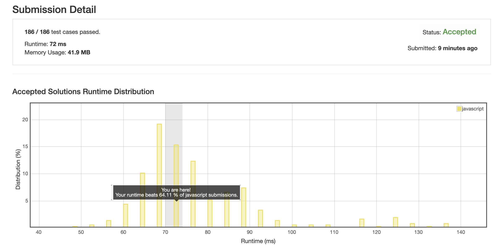
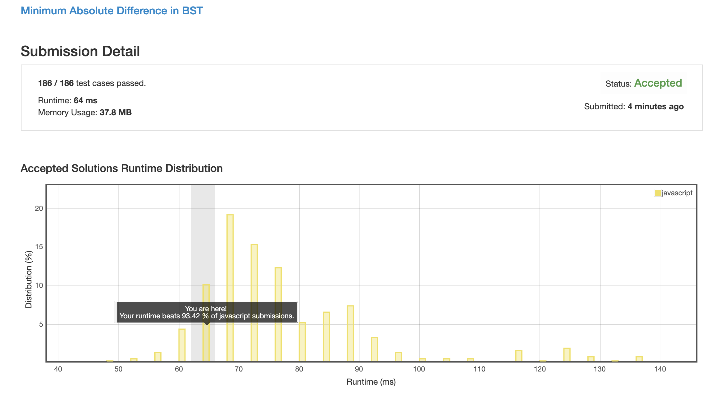

# 0530. 二叉搜索树的最小绝对差

这道题的本质就是求相邻两数差的最小值 (因为 A / B / C 三个数字, A & B or B & C 的两数差绝对小于 A & C 的两数差, 完全没必要证明).

## 解法 1 ([noob.js](./noob.js))

很弱智的做法, 把整个数组摊平, 然后遍历一遍求, 复杂度也是 O(n), 但是略高于解法 2.

## 解法 2 ([ldr.js](./ldr.js))

直接用中序遍历, 搞一个外面的变量缓存上一个值, 这样就少了一步生成缓存数组和遍历的操作, 时间复杂度相较于解法 1 除以 2.

