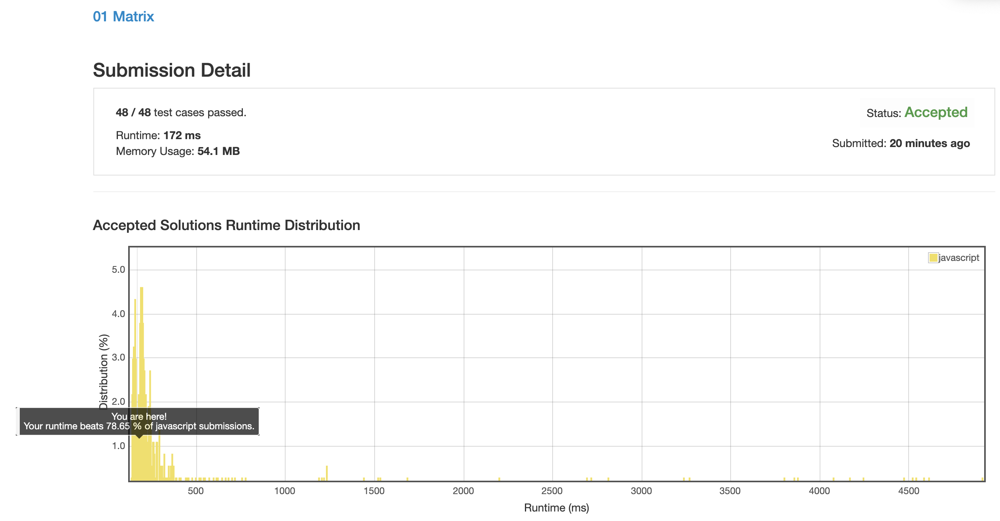

# 0542. 01 矩阵

__TODO__ 性能还没达标

## 解法 1 ([dijkstra.js](./dijkstra.js))

用了迪杰斯特拉的思想, 初始化 result 矩阵的时候先把所有的 0 坐标都记入 todo 数组.

然后开始遍历 todo 数组, 并更新其周围值的距离, 如果某个点距离被更新了, 就塞到 todo 数组里去.

一直处理到 todo 数组为空就好了.

### 优化点

1. 在初始化 result 的时候, 有些周围全都是 0 的点就没必要再加到 todo 里去了, 因为周围根本没有点可以更新, 浪费时间.

1. 一开始我的 todo 数组是真的用数组在做, unshift 和 pop 的操作实在是太多了, 数组本身性能跟不上.

    一开始想用链表来做, 后来想了下, 我的内存占用目前是满分, 舍弃一些空间, 直接搞一个足够大的数组来做游标队列记录不是又快又简单么.
    
    改造之后性能直接翻番.
    

