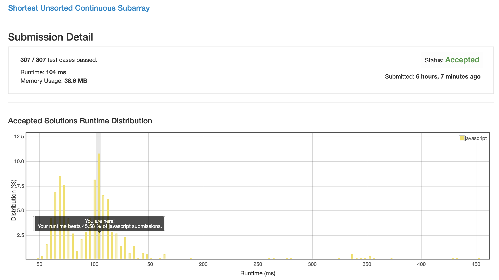
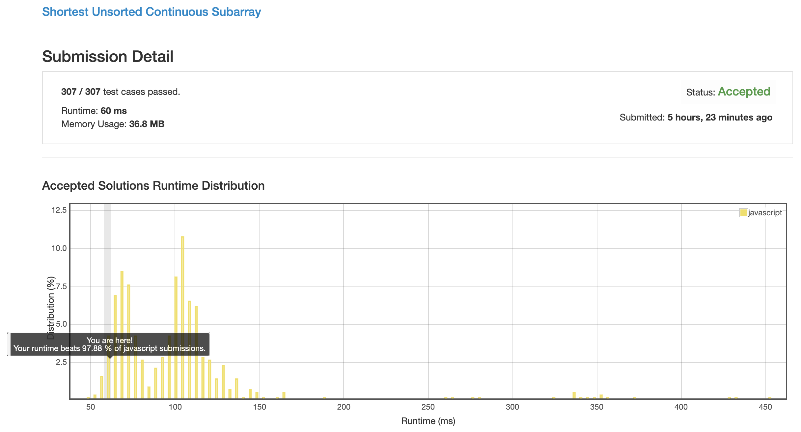

# 0581. 最短无序连续子数组

## 解法 1 ([noob.js](./noob.js))

非常弱智的做法, 直接把原数组拷贝一份然后排序, 看看从哪个位置开始不对了.

## 解法 2 ([extremum.js](./extremum.js))

从两端开始, 寻找第一位不对劲的位置.

从此位置开始, 寻找最小 (大) 值 (左边找最小, 右边找最大).

找到之后, 再从两端开始遍历数组, 找到这两个数字应该呆的位置, 中间的数组就全都是错误的了.

