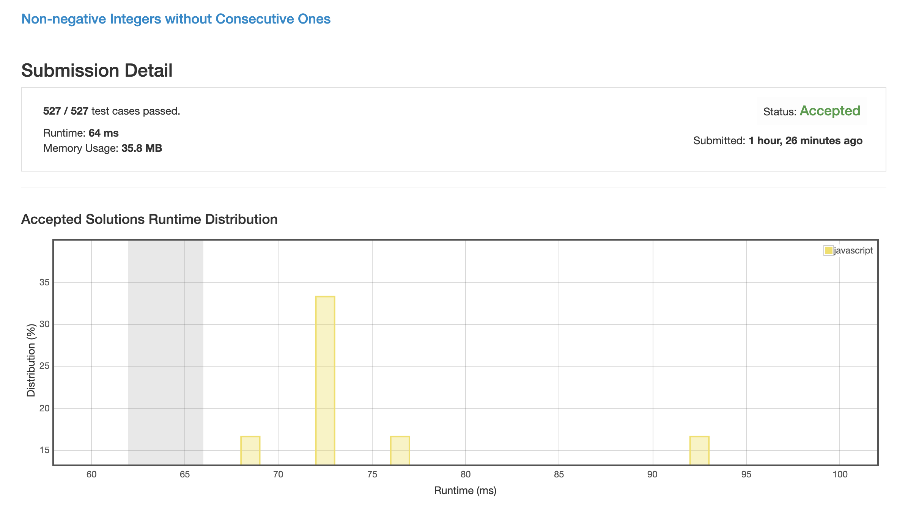
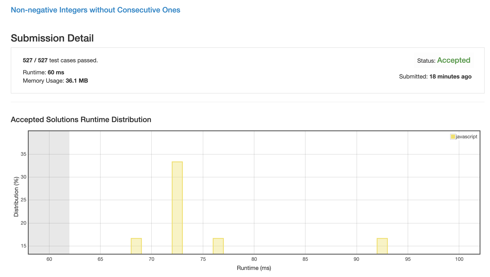

# 0600. 不含连续 1 的非负整数

## 核心思路

__Q:__ 如何求 n 位的 2 进制数字的所有可能中不含连续 1 的数字的个数? 

__A:__ 分为以下几步:

1. 分解数字, n 位 2 进制数字 === 00000... ~ 11111...

1. 从中找出不含连续 1 的数字, 则可分为两种情况:

    1. 00000... ~ 01111...
    
        这种情况就等同于求 n-1 位 2 进制数字中不含连续 1 的数字的个数.
    
    1. 10000... ~ 10111...
    
        这种情况就等同于求 n-2 位 2 进制数字中不含连续 1 的数字的个数.
        
    * 11xxx... 的情况因为有连续 1 前缀所以肯定不在正确结果之中, 直接排除.

1. 由上一步可得:

    ```
    f(n) = f(n - 1) + f(n - 2)
    ```
    
    也就是说 n 位二进制数字中非连 1 情况的数量就等于斐波那契数列的第 n 位.
    
1. 但这只是求了 n 的整次方下的所有情况, 真正问题中, 数字是由多个不同二进制数字组成的, 比如:

    11 = 0b1011
    
    也就是说小于 11 的数字中, 二进制非连 1 的情况个数是需要进行累加计算的, 两种不同的累计方法如下:

## 解法 1 ([minus.js](./minus.js))

太绕了, 看不懂.

个人感觉因为循环中判断数量太多, 导致稍微比方法 2 慢了一点.

而且很神奇的是我感觉两个 fib 数组太占空间了, 初始化也浪费时间, 于是就进行优化. 合并成一个数组以后反而更慢了.

1. 先求出 n 位的情况总数, 也就是 f(n - 1) + f(n - 2).

1. 但是这种情况是计算了 00000... ~ 11111... 的所有情况, 而我们的数字是 1xxxx... 并没有覆盖住整段数字, 所以需要从中进行减除

1. 从高位开始逐位计算

    每两个连位存在四种情况:
    
    + [1]1: 存在连 1, 也就是说基于此前缀的所有可能都是无效的, 任何大于当前数字的值都不可能存在非连 1 数字了. 
    
        而且因为 11 > 10 > 01 > 00, 所以所有小于 11 开头的数字中不存在连 1 的数字应该要被包含在总结果中, 不应被减去.
        
        综上所述, 因为:
        
        已连 1, 所以大于该数字的数字中都不会有非连 1 数字了.
        
        &
        
        因为 11 是最大的数字, 所以小于它的所有 case 都应该包含在总结果中.
        
        所以目前的总数就是结果, 直接返回.
    
    + [1]0: 如果前一位是 1 的话早就崩了跳出去了, 所以这里前一位肯定是 0.
    
        当前就相当于 fib 的 case 2, 10 开头后面的一堆情况, 不需要从总数中扣除该前缀引导的可能结果的数量
    
    + [0]1: 如果前一位是 0 的话早就减去了不该出现的可能数量了, 所以这里不需要额外的计算操作.
    
        当前就相当于 fib 的 case 1, 01 开头后面的一堆情况, 不需要从总数中扣除该前缀引导的可能结果的数量 
    
    + [0]0: 相当于这一位直接空过去了, 所以要减掉这一位上的可能结果总数.

1. 最后返回结果.



## 解法 2 ([add.js](./add.js))

个人比较推荐这种解法.

1. 从高位开始计算:

    + 当前位为 1, 直接把 fib(n - 1) 加上.
    
        如果前一位为 0, 那没什么问题, 继续计算.
        
        如果前一位为 1, 那后面也没什么可能了, 直接跳出.
    
    + 当前位为 0, 直接空过去

1. 最后返回结果 (最后加的这个 1 我没看懂, 可能是加上全为 0 的那种情况?).



## 优化点

现有算法中的遍历部分都是 O(n) 复杂度, 已无法优化.

但在求 fib 数组时, 因为 10^9 < 2^30, 所以他们都是直接求了 30 长度的 fib 数组.

在求 fib 数组时直接砍一刀, 根据数字长度求 fib 数组, 可以有效降低计算 fib 时的时间消耗.

## 思路来源

减法版:

[https://leetcode.com/problems/non-negative-integers-without-consecutive-ones/discuss/103749/Java-Solution-DP](https://leetcode.com/problems/non-negative-integers-without-consecutive-ones/discuss/103749/Java-Solution-DP)

加法版:

[https://leetcode.com/problems/non-negative-integers-without-consecutive-ones/discuss/103754/C%2B%2B-Non-DP-O(32)-Fibonacci-solution](https://leetcode.com/problems/non-negative-integers-without-consecutive-ones/discuss/103754/C%2B%2B-Non-DP-O(32)-Fibonacci-solution)
