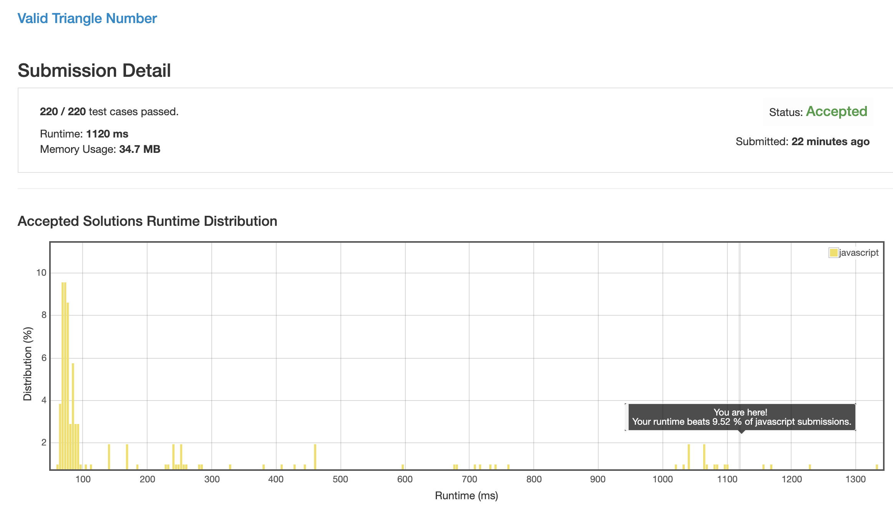
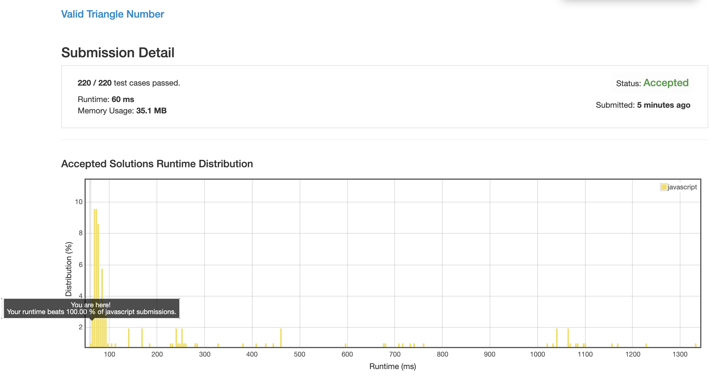

# 0611. 有效三角形的个数

## 解法 1 (noob.js)

暴力破解, 直接三层循环判断每个三角形是否存在.

## 解法 2 (both-ends.js)

上一种方法之所以弱智, 原因就在于能够形成三角形的三边数字, 是一个范围, 而非特定的值, 只要在这个范围内的所有值, 都是可以的, 不需要单独进行遍历.

我们先将数组排序.

从后往前遍历数组, 因为当前取值为最大值, 所以只要另外两条短边之和大于当前边即可. 这样就已经减少了两次判断.

在内层遍历时把游标设在剩余长度的两端, 从两端向内缩进.

因为右侧已经是剩余数值的最大值了, 此时如果两数之和小于最大边, 只可以将左值右移.

直到左右相加大于最大边, 此时其内的所有数值都可建立三角形, 直接统计左右差值加入结果中.

将右值左移一位, 左移后右值变小, 可用的左值范围继续缩小, 所以不存在回溯问题.

最终左右相遇, 完成一次遍历, 缩小最长边大小, 重复上面的行为.

### 思路来源

[https://leetcode.com/problems/valid-triangle-number/discuss/104174/Java-O(n2)-Time-O(1)-Space](https://leetcode.com/problems/valid-triangle-number/discuss/104174/Java-O(n2)-Time-O(1)-Space)
