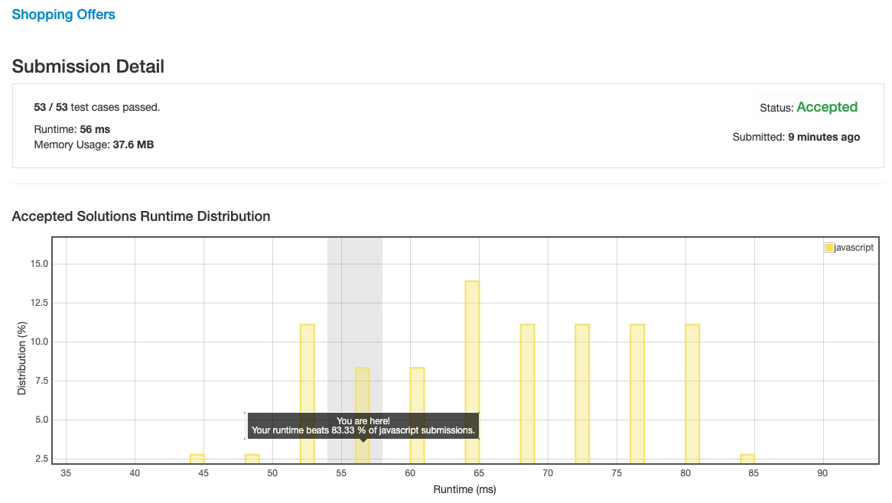

# 0638. 购物优惠

## 解法 1 ([dynamic-programming.js](./dynamic-programming.js))

因为本题存在最多 6 个商品, 每个商品最多买 6 个, 所以如果建表的话, 可能是一个 7 * 7 * 7 ... 的多维图形 (因为每个商品都有 0~6 7 种 case, 每种 case 的情况下其他每个商品又有 0~6 7 种 case, 反复叠加就是多维了).

所以不好直接建表, 这里就通过结果 case 反复叠减来向源数据 (0, 0, 0, 0 ...) 靠拢 (其实从 0 开始叠加到目标也可以, 只是不好写判断).

把结果填入 todo 数组, 然后使用每个套餐进行匹配, 并把匹配结果 (扣掉了套餐不会变负的情况下的总金额) 填入 map, 如此往复循环, 直至一个套餐也买不了为止.

此时 map 中便有了所有 case 的情况, 遍历并将剩余未购买商品通过零售方式购买, 最便宜的就是最终结果.

