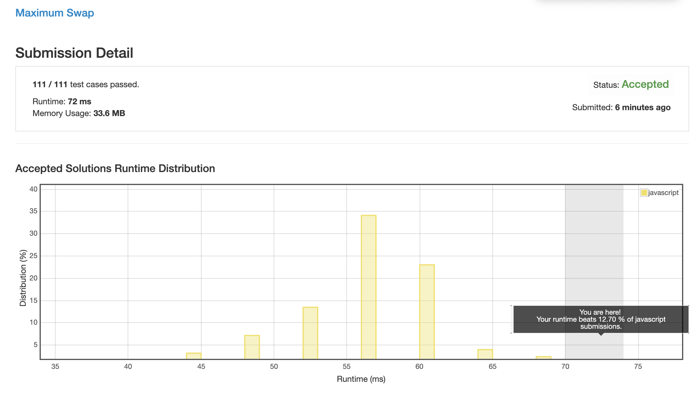
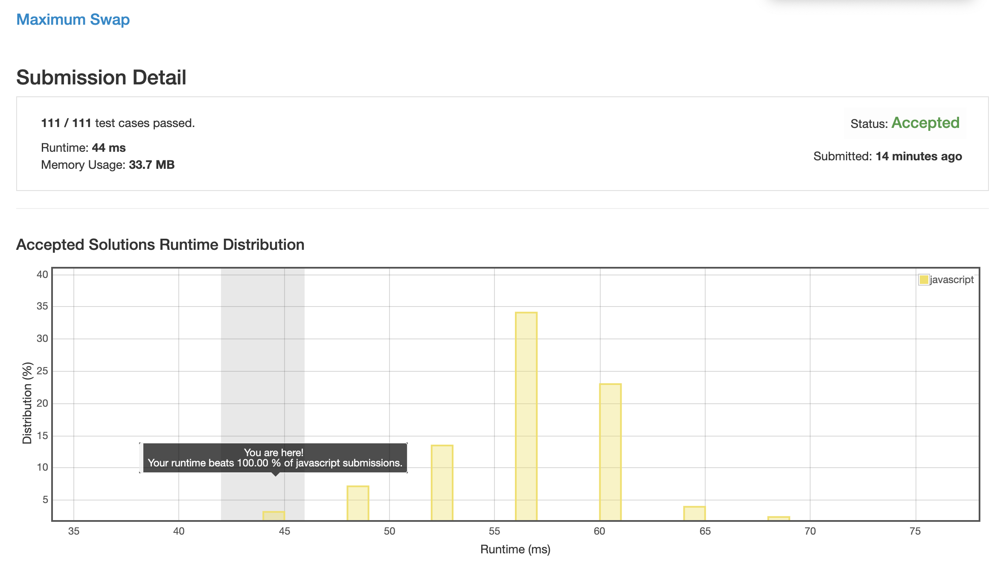

# 0670. 最大交换

## 解法 1 (max-value.js)

将整个字符串打散重组, 排序后与原字符串进行对比, 找到第一位不一样的就进行查找交换.

此解法效率极低.

### 问题分析

本身需要一次排序, 按最快的快排来说就已经是 O(nlogn) 的复杂度了.

后面又要进行两次搜索 (一次从前向后查找第一个不一样的数字, 一次从后向前, 寻找第一个值等于 max 的位置), 复杂度 o(n).

## 解法 2 (recursion.js)

将数字拆分, 所有位取 max.

将 max 与当前第一位比较, 如果不同, 交换, 返回.

如果相同, 去掉第一位, 再次调用本函数.

该解法的复杂度等于 o(n * o(Math.max))

这个解法的关键就在于 `Math.max` 的时间复杂度, 如果它的复杂度小于 o(logn), 则该解法效率更高.

事实证明 javascript 内 Math 的实现还是靠谱的.

