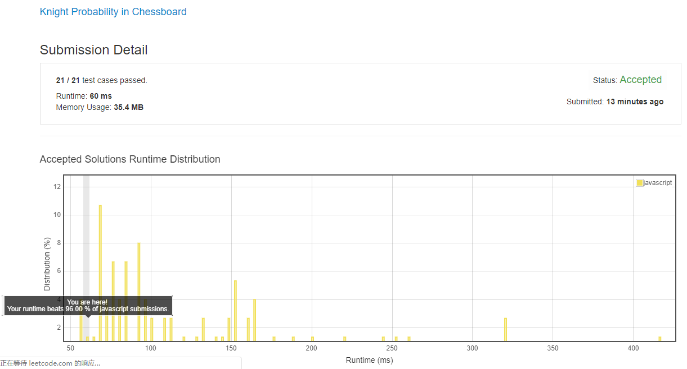

# 0688. “马”在棋盘上的概率

这题也很考验语文水平, 题目描述的很含糊, 经实测得出结论:

马跳出棋盘后是不会再回来的 (也就是说是求 “经 n 次以后还在棋盘上的数量”, 而不是 “经 n 次后还能回到棋盘上的数量”).

## 解法 1 ([noob.js](./noob.js))

非常简单, 就是不停地走棋子, 完全模仿正常移动的所有 case.

看了下讨论区的 DP 算法, 感觉甚至不如我这个 noob 算法, 他要倒推棋盘上的每个格子在 N 步前是来自哪个格子的概率是多少, 然后用总概率再去除.

这样的话整个棋盘 N*N 每个位置要遍历 8 次 (8 个方向), 遍历 K 次, 时间复杂度 `O(8*K*N^2)`, 约等于 `O(n^3)`.

但如果像我的做法一样全部遍历, 也只需要 N*N 每个位置遍历, 但因为我的判断条件进行过聚合, 所以肯定小于 8, 遍历 K 次, 也是约等于 `O(n^3)`, 但肯定比 DP 小.

