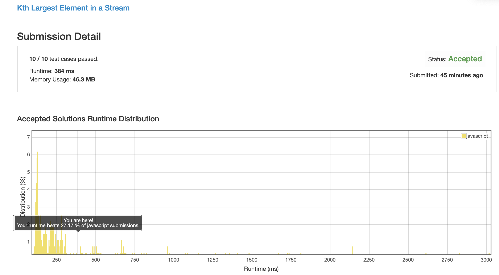
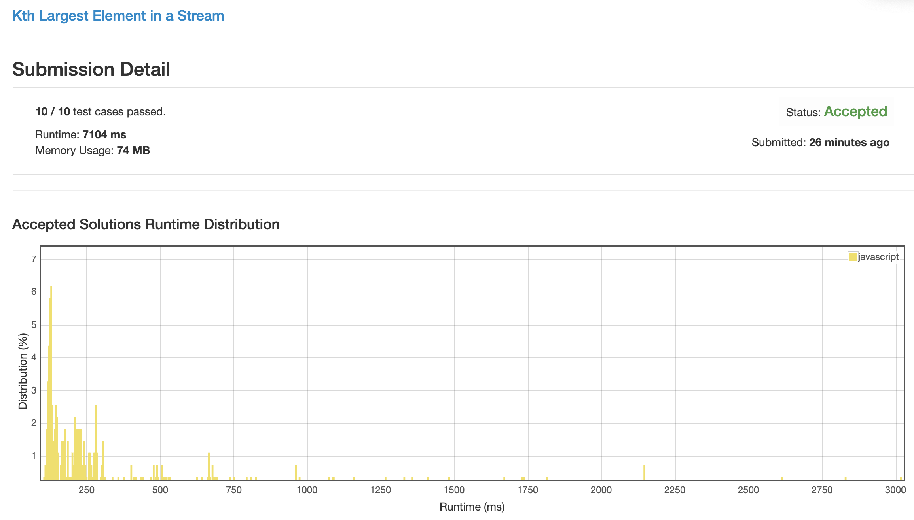
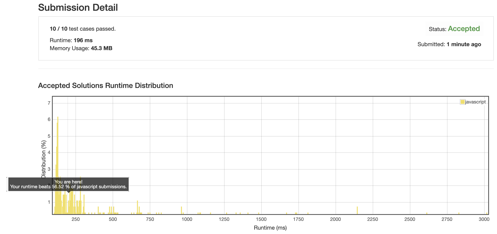

# 0703. 数据流中的第 K 大的元素

虽然是道 easy 的题目, 但数据结构性能的优化却是 medium 难度的.

## 解法 1 ([linked-list.js](./linked-list.js))

我最开始做的时候是用的数组, 但因为一些处理不够合理, 导致性能很差, 这里用链表存储数组数据, 加快存取速度.

## 解法 2 ([mark.js](./mark.js))

仔细想了下, 因为内容都是数字, 所以应该可以用数字标志位来计数.

但是因为有负数, 所以需要给全部数字都加一个很大的数字来做 key.

最后的结果就是性能爆炸.

## 解法 3 ([array.js](./array.js))

我也不知道为什么, 我自己的写法, 先寻找 `index` 值, 再根据 `index` 值确定是否插入以及插入位置的方法.

竟然比直接循环, 然后在循环里找到位置插入并 break, 最后再 pop 元素的方案要慢, 难道因为我从小头开始遍历的?

_(雾草我试了下还真是, 从大端开始遍历就是比小端快_

## 解法 4 (__TODO__)

__TODO__ 实在没时间来实现这么个玩意了.

使用小顶堆加速数据存取.

### 思路来源

[https://leetcode.com/problems/kth-largest-element-in-a-stream/discuss/228149/Simple-Javascript-solution-beat-100](https://leetcode.com/problems/kth-largest-element-in-a-stream/discuss/228149/Simple-Javascript-solution-beat-100)
