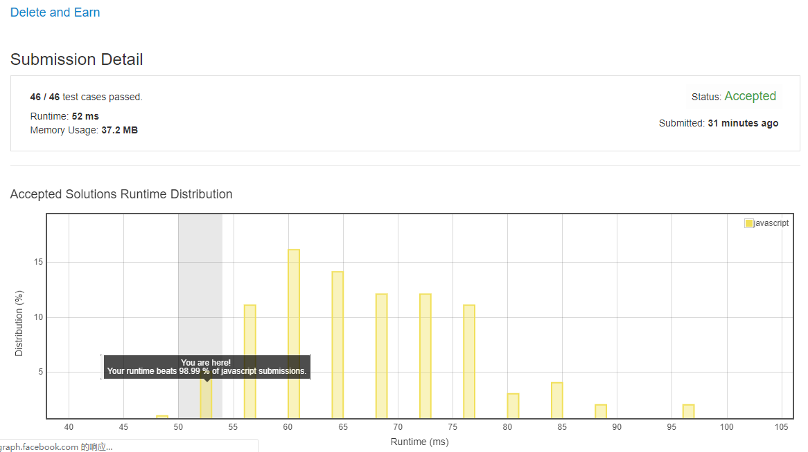

# 0740. 删除与获得点数

这题难点主要在于理解题干, 题目的意思是:

取了一个值以后, 比它小 1 / 大 1 的项都不能再取了, 并且要把取的这个值的所有值全都加到结果中. (正确示例: [2, 2, 3, 5] -- 取 3 --> [5])

而不是:

取一个值, 只取一个数字, 并删掉比它大 1 / 小 1 的数字各一个. (错误示例: [2, 2, 3, 3, 4, 4] -- 取 3 --> [2, 3, 4])

也不是:

取一个值, 比它大 / 小的最近的值一个值全都不能再取了. (错误示例: [1, 1, 3, 4, 4, 5] -- 取 3 --> [5])

我真是吃了语文 (英语) 的亏.

## 解法 1 ([dynamic-programming.js](./dynamic-programming.js))

还是动态规划, 我也想到了, 只是脑子太混 + 语文不好, 计算出了问题.

按照题意, 每一位都会有两种状态: 取或不取.

不取没有任何前置条件, 无论前一位是否取了, 都可以设置.

而取的前提是前一位不取.

所以 `max(不取) = max(前一位取, 前一位不取)` (因为本身这一位是不取的, 所以不需要加任何值).

而取则为 `max(取) = 前一位不取 + 本位数值`.

所以我们便可以使用这个公式来不断推进某一位 (i) 再取和不取时的最大值, 来求到第 (n) 位的结果.

根据上面的推断, DP 公式为: 

```
take = skipLast + cur;
skip = Math.max(takeLast, skipLast);
```

### 优化点

因为数值 1 < n < 10000, 所以我们搞了个 10001 长度的数组来加速计算.

但一般数字很少有能全部占满的, 一般在很小的时候就已经结束了, 所以在一开始的数组构造阶段记录下数字的最大值, 这样在后面遍历求 skip 和 take 的时候就可以至少减少一半的循环.

### 思路来源

[https://leetcode.com/problems/delete-and-earn/discuss/109895/JavaC%2B%2B-Clean-Code-with-Explanation](https://leetcode.com/problems/delete-and-earn/discuss/109895/JavaC%2B%2B-Clean-Code-with-Explanation)


