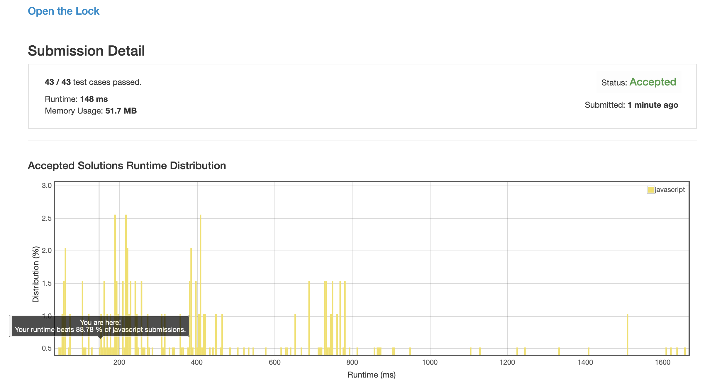

# 0752. 开锁

## 解法 1 ([bfs.js](./bfs.js))

就是非常简单的 bfs 做法, 每层 +1, 一旦某蹭碰到结果就直接返回.

### 优化点

一定要搞 visited, 否则连做都做不出来.

### 思路来源

[https://leetcode.com/problems/open-the-lock/discuss/110237/Regular-java-BFS-solution-and-2-end-BFS-solution-with-improvement](https://leetcode.com/problems/open-the-lock/discuss/110237/Regular-java-BFS-solution-and-2-end-BFS-solution-with-improvement)

