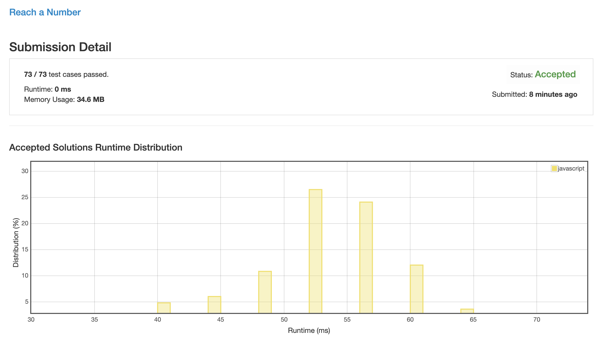

# 0754. 组装数字

## 解法 1 ([accumulation.js](./accumulation.js))

这个题目需要理解一个数学原理:

```
(±)1 / (±)2 / (±)3 / (±)4 / ...
```

如果想要拼成一个数字, 当这个数字与 `1 + 2 + 3 + 4 + ...` 的差为偶数时, 可以通过翻转 `(sum(1 ~ n) - target) / 2` 位置的值的符号 (由正转负) 来实现.

因为这个数值由正转负, 就相当于总和中减少了两倍于它的值.

而如果是奇数, 也不要怕, 因为 `奇数 + 奇数 = 偶数`, `奇数 + 偶数 = 奇数`, 而数字的奇偶是交叉的, 所以只要不断继续加下去, 差值迟早会变成偶数的.

### 思路来源

[https://leetcode.com/problems/reach-a-number/discuss/112968/Short-JAVA-Solution-with-Explanation](https://leetcode.com/problems/reach-a-number/discuss/112968/Short-JAVA-Solution-with-Explanation)


