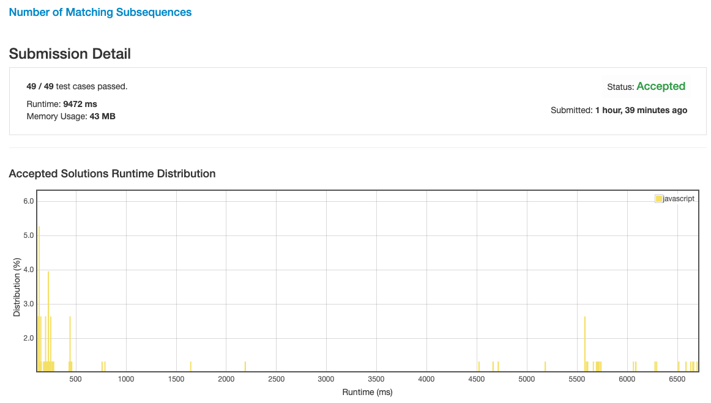
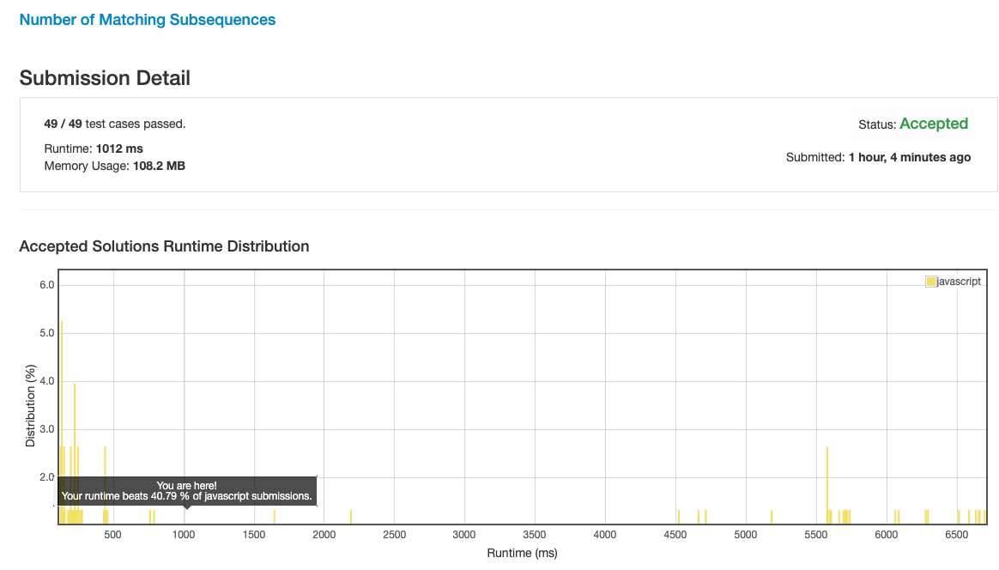

# 0792. 匹配子序列的单词数

## 解法 1 ([noob.js](./noob.js))

非常弱智的解法, 搞个额外的数组, 单独计算 `words` 里每个词匹配到什么位置了.

遍历 `S` 的每一位, 并且跟 `words` 里的每个单词进行匹配, 对位匹配得上的话就在上面那个标记数组里把对应位置的标记往后推 1.

最后计算结果里有几个把标记位推到了字符串长度的位置.

这个算法的复杂度是 `O(n^3)`, 能运行完不超时已经是万幸了.

## 解法 2 ([tree.js](./tree.js))

这里我想到了可能会有很多字符串的头部是相同的, 所以我们可以通过树的结构来复用这些重复的片段.

初始化的时候构造一个树, 将字符串数组完全拆分, 根据每一位来构造树 (每构造完一个都会设置一个标志位, 来标记这是一个字符串的结束).

计算的时候也是遍历一遍 `S`, 逐位进行匹配.

算一下当前树上, 有没有跟 `S` 当前位匹配的 key, 如果有, 就把这个树摘下来, 把它的每个子挂到树上.

上面的难点在深合并上, 感觉我的性能都是被初始化操作 & 深合并搞垮的 (另外树节点对象的构建也是, 感觉真没必要).

后来还有个用数组存放每个分支上的元素的版本, 效率是一样的还更难理解, 就不贴了.

最后性能算是能打败一半的人了.

## 解法 3 ([substr-jit-array.js](./substr-jit-array.js))

既然上一步的主要性能阻塞在于合并, 初始化还有节点结构, 那这里就想办法把这个搞掉.

刚考虑了下, 实际上每次与 S 进行匹配的时候还是会进行一次对整个结构的遍历, 所以初始化树结构是根本没有必要的.

再进一步说, 可以直接把树结构去掉, 整个 tree 也改成一个 map, key 为首字母, value 为剩下的字母.

这样每次匹配到一位时再进行处理, 将剩下的位添加到 map 的其他位置, 一直重复直到字符串全匹配为止.

这样就可以一下解决上面的三个问题了:

1. 初始化耗时 (用时计算, 不再初始化);

1. 结构消耗性能 (无结构, 存储字符串, 现用现处理);

1. 树合并 (不光不需要合并结构体了, 之前结构体中记录的 value 还需要额外的合并时处理现在也省了).

### 优化点

一开始我用的是 map, 后来看了讨论区的一些讨论 (都在用, 没必要贴了).

他们都用了数组来加速计算, 因为本题的字符串都是小写, 也只有 26 个, 所以完全没必要搞个 map 来消耗性能.

用一个长度为 26 的数组, 每次存取的时候计算下 key 就可以了.

100% 达成!

_Ps: 我也不知道为啥, 有行 console.log 忘记删了竟然也能 100%._

