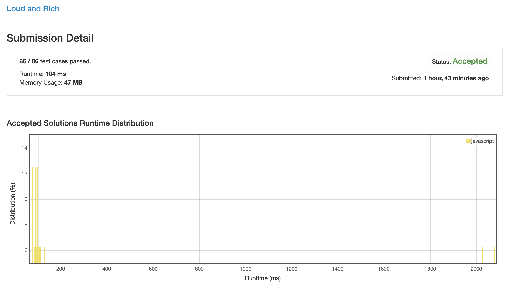
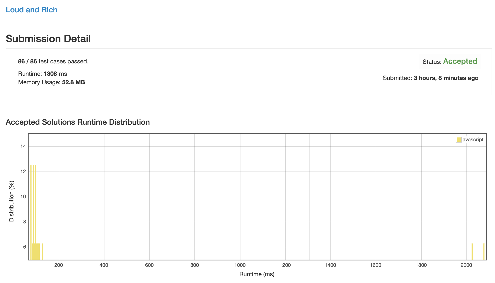
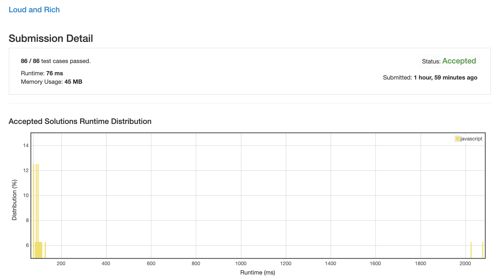

# 0851. 喧闹的富人

## 解法 1 ([jit.js](./jit.js))

1. 初始化一个 list, 存每个人的直接更富名单;

1. 遍历这个 list, 并实时计算比这个名单里的人更富的人, 直到全部算完为止;

1. 遍历这些人的喧闹程度, 找出最安静的, 即为当前位置的结果.

今天 leet 好像出 bug 了, 截图里没有显示百分比, 这一题我的排位是 43.75%.

### 优化点

在看了解法 3 的方法以后, 在连锁反应时加了缓存, 已计算过结果的直接用那个结果, 不再继续连锁, 效率提高 4 倍, 但还是赶不上纯 dfs 解法, 应该是结构构造太复杂了导致的.



## 解法 2 ([dynamic-programming.js](./dynamic-programming.js))

初始化一个 n * n 的矩阵, 其含义为 `a[m][n] = 1` 时, 表示 m 的资产大于 n.

按照输入 `richer` 数组, 初始化矩阵.

而后逐列 (第二个参数) 遍历, 拿所有 = 1 的值进行对比, 找出其中的最小值, 就生成结果了.

这也没法优化了, dp 做法强制全遍历, 再用 result 来优化也没什么影响了.

今天 leet 好像出 bug 了, 截图里没有显示百分比, 这一题我的排位是 18.5%.



## 解法 3 ([dfs.js](./dfs.js))

因为本题不存在 `a > b > c > a` 的悖论, 所以使用 dfs 是不会出现无法退出的环状递归的.

所以可以使用如下递归式 (数学公式这里没法贴, 就用伪代码吧):

```
if (richerList.length > 0) {
    f(n) = Math.min(richerList.map(f))
} else {
    f(n) = n;
}
```

这里的重点是使用数组缓存结果, 如果结果已经计算过了, 那么就不再进行递归计算了.

### 思路来源

[https://leetcode.com/problems/loud-and-rich/discuss/137918/C%2B%2BJavaPython-Concise-DFS](https://leetcode.com/problems/loud-and-rich/discuss/137918/C%2B%2BJavaPython-Concise-DFS)

今天 leet 好像出 bug 了, 截图里没有显示百分比, 这一题我的排位是 100%.


