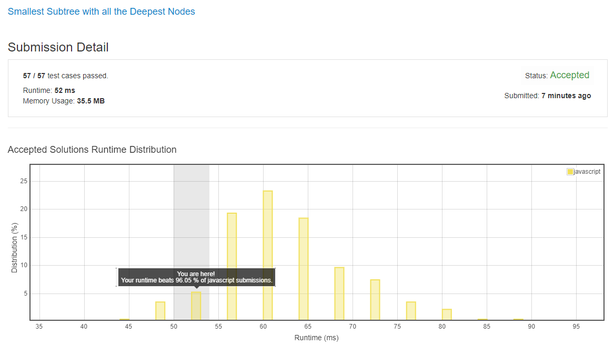

# 0865. 具有所有最深结点的最小子树

## 解法 1 ([dfs.js](./dfs.js))

刚开始做这个题的时候, 我的思路是, 既然是求最深的一层, 那么广度优先遍历应该是最合适的.

但后来仔细品读题意之后发现, 最深的两个节点距离很可能非常远, 甚至根本就是根节点.

所以深度优先 + 标记才是最适合的做法.

先通过深度优先求出最深的路径的集合 (是一个数组的数组).

然后再求这个数组所有元素的最长公共前缀.

最后用这个公共前缀找到那个节点.

