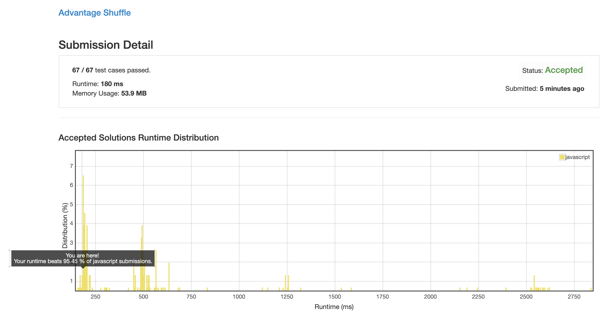

# 0870. 优势洗牌

## 解法 1 ([cursor-mark.js](./cursor-mark.js))

思路很简单:
 
1. 两个数组都进行一次排序 (注意不要破坏第二个数组的结构).

1. 两个数组从尾部开始同时向前推进, A 比 B 大就记入 map 中, 并同时前移两个游标.

1. 如果 B 比 A 大或两者相等, 就把 B 的向前推进一位.

1. 如此循环至 B 数组处理完.

1. 根据 B 的原数组顺序开始生成结果.

1. 如果当前位置 map 中有记录, 就读取一条记录填入.

1. 如果当前位置 map 中无记录, 就直接向前推进一下 A 的游标, 将其中的数字填入结果 (不影响结果的位子填什么都无所谓).

1. 最后计算完的数组就是结果了.

