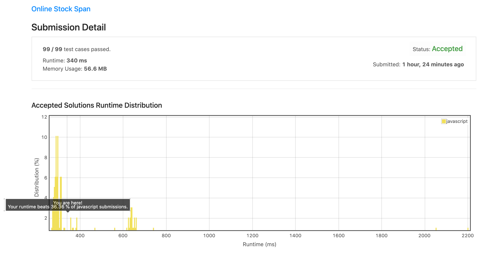
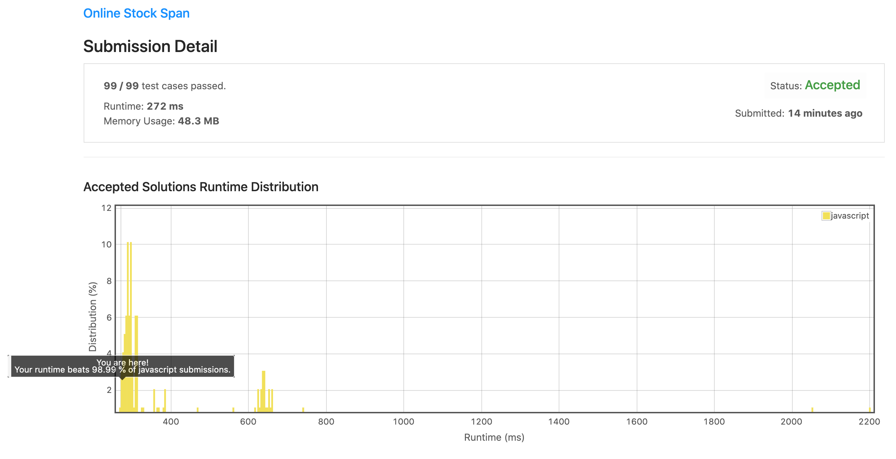

# 0901. 股价跨度实时记录

## 解法 1 ([record.js](./record.js))

最质朴的记录回溯法, 没有特别的技巧.

### 优化点

1. 如果运行环境支持原生 ES6 类语法, 就不要用 ES5 的 function 模拟类语法. 



## 解法 2 ([stack.js](./stack.js))

∵ 本题只要求记录本次及之前连续比本次低的数值的个数
∴ 如果前一次记录的值低于本次记录, 本次记录 = 前次记录的值 + judge(前前次记录 case)
∴ 如果前一次记录的值高于本次记录, 则停止向前回溯, 并返回记录数 `0`.

∵ 本题要求比较记录连续
∴ 当前记录的后一条比当前记录小时, 根本不会触及当前记录前的记录
∴ 当前记录的后一条比当前记录大时, 也将大于小于当前记录的前一条记录
∴ 可以直接把当前记录和前一条小于当前记录的记录合并

因为本题目要求实时输入, 故无法直接使用递归, 而所有递归均可转化为堆栈, 所以可以直接转化为以下堆栈:

```typescript
Stack<[record, count]>
```

### 思路来源

+ [https://leetcode.com/problems/online-stock-span/discuss/168311/C%2B%2BJavaPython-O(1)](https://leetcode.com/problems/online-stock-span/discuss/168311/C%2B%2BJavaPython-O(1))

### 优化点

+ 数组创建效率低于原始值, 且堆栈结构标准, 可以直接展开为一维数组
+ JS 的数组实为链表结构, 频繁的 push pop 操作性能很差, 故可以直接记录一个全局的 length 值, 减少修改数组长度的操作次数
  

