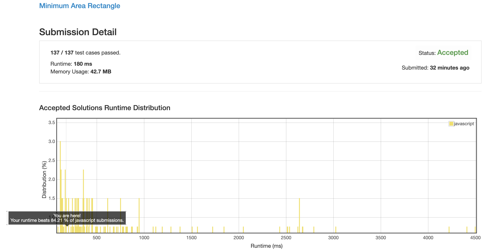

# 0939. 面积最小的长方形

## 解法 1 ([normal.js](./normal.js))

非常简单的做法, 就是遍历每个点, 寻找它和另一个点是否还存在能够构造出长方形的另外两个顶点.

如果存在, 那就计算下面积看看是不是更小, 就这么循环直到全都算完.

### 优化点

原始的计算方法是先构造 map 再回头进行 map 匹配计算.

但这样会匹配很多没有意义的点, 我这里直接在构造过程中进行匹配.

每个新点插入之前都会与所有老点进行一次匹配, 这样至少可以减少一半的运算量.

这样做还能把 `x1 === x2` & `y1 === y2` 的计算拆分开来, 进一步提高剪枝效率.

### 思路来源

[https://leetcode.com/problems/minimum-area-rectangle/discuss/192025/Java-N2-Hashmap](https://leetcode.com/problems/minimum-area-rectangle/discuss/192025/Java-N2-Hashmap)

