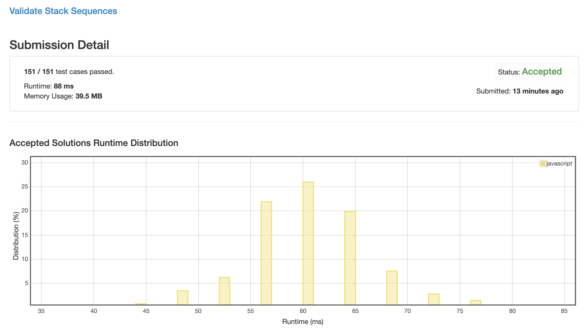
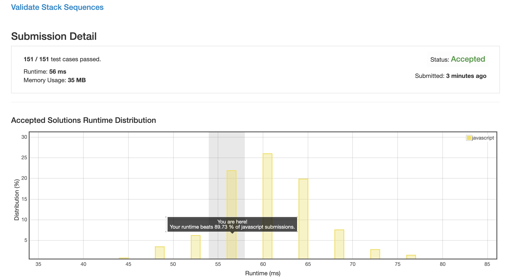

# 0946. 校验堆栈顺序

## 解法 1 ([validate.js](./validate.js))

一个值 n 只要满足了以下两条条件中的任意一条, 就可以被从当前位置 pop 出来:

1. 在比他早 pop 出来的值中没有比他晚 push 进去的

1. 假如比他早 pop 出来的值中有比他晚 push 进去的, 那么这些值必须满足:

    从 n+1 开始, 且连续, 也就是:
    
    ```
    // 合法的值
    [3, 4, 5, 2]
    
    // 不合法的值 (因为不连续, 所以这时肯定有一个 n+x 压在 n 上面, n 是 pop 不出来的)
    [3, 5, 2]
    
    // 不合法的值 (因为没有从 n+1 开始, 所以这时候肯定有一个 n+1 压在 n 上面, n 是 pop 不出来的)
    [4, 5, 2]
    ```
    
所以就遍历整个数组, 一旦某一位不合规则, 就直接报错.
    
### 优化点

目前看来当运行到后半段的时候, 基本上会遍历整个数组, 效率很低, 这里应该再找一个后半段用的判断规律, 目前我还没找到.



## 解法 2 ([simulator.js](./simulator.js))

这里直接模拟了堆栈的行为.

不断地向内 push 数据, 直到与第一个 pop 匹配时开始 pop.

并在未匹配到新栈顶时不断 push, 只要栈顶匹配, 就不断 pop.

到最后看看全都 push pop 完后栈是否是空的, 如果是不是空的则证明肯定在某一步卡住了.

### 思路来源

[https://leetcode.com/problems/validate-stack-sequences/discuss/197667/Java-straight-forward-stack-solution.](https://leetcode.com/problems/validate-stack-sequences/discuss/197667/Java-straight-forward-stack-solution.)


